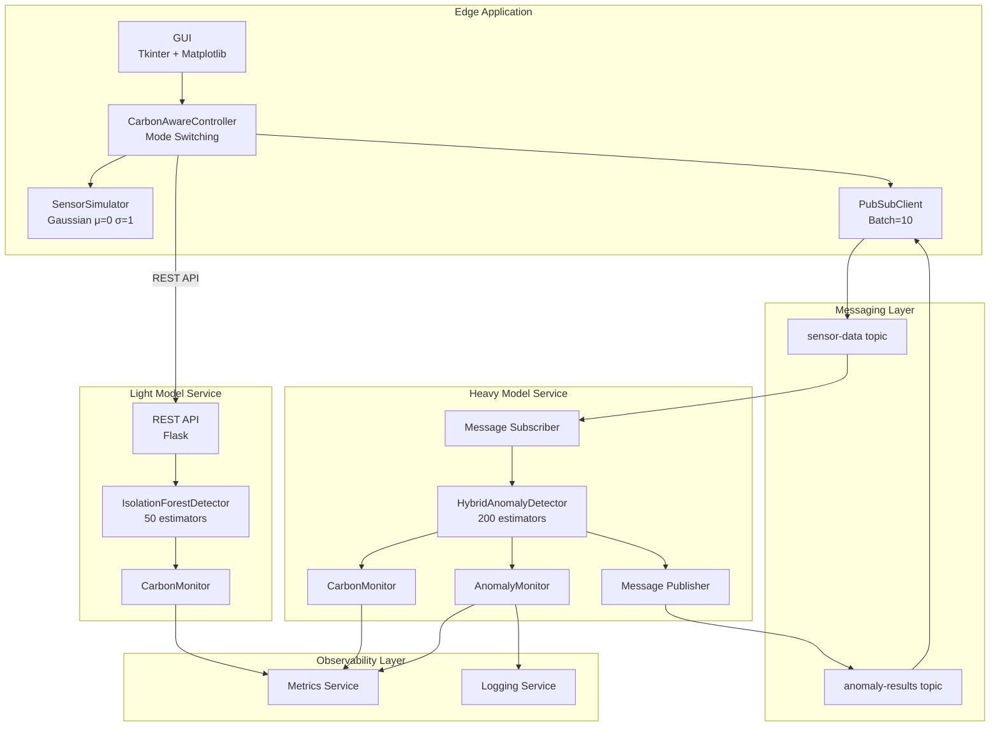
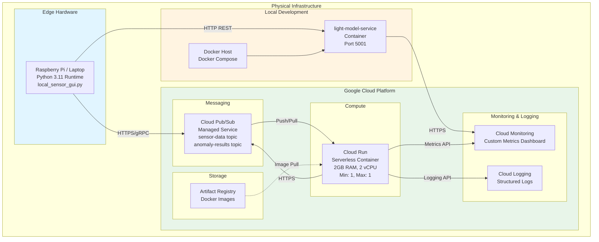
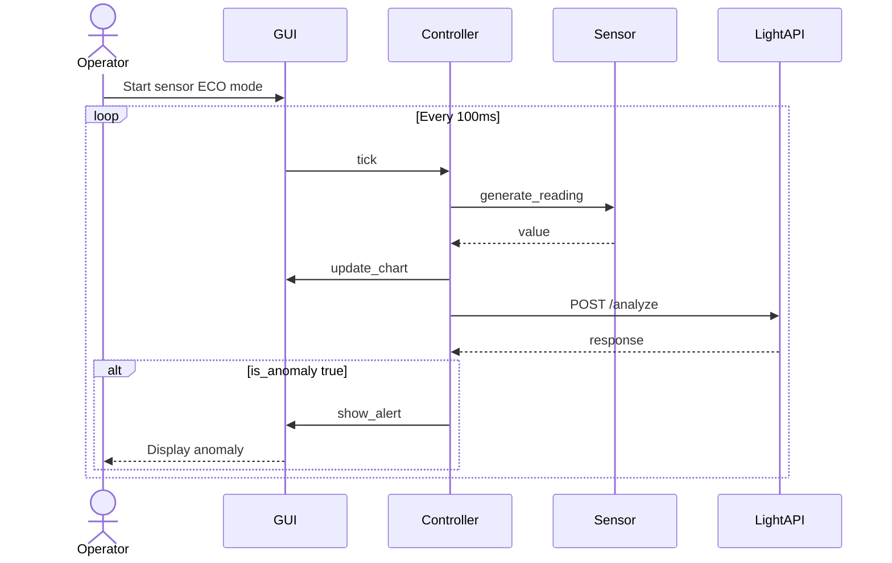

# Carbon-Aware IoT Anomaly Detection System

## Table of Contents

- [Project Overview](#project-overview)
  - [Business Value](#business-value)
- [Architecture Decision Records](#architecture-decision-records)
- [Service Level Objectives (SLOs)](#service-level-objectives-slos)
- [Architecturally Significant Use Cases](#architecturally-significant-use-cases)
- [System Architecture](#system-architecture)
  - [Component Diagram](#component-diagram)
  - [Deployment Diagram](#deployment-diagram)
  - [Sequence Diagram](#sequence-diagram)
- [Current Implementation Status](#current-implementation-status)
- [Getting Started](#getting-started)
- [Technology Stack](#technology-stack)

---

## Project Overview

The **Carbon-Aware IoT Anomaly Detection System** is a hybrid edge-cloud platform for **industrial vibration sensor monitoring**. It detects mechanical anomalies (bearing failures, shaft imbalance, resonance issues) in rotating machinery by analyzing vibration amplitude signals.

### Signal Characteristics

The system processes vibration sensor readings with the following characteristics:
- **Normal operation:** Gaussian distribution (μ=0, σ=1)
- **Anomaly rate:** ~0.3% of readings (approximately 2 anomalies per minute at 10 Hz sampling)
- **Small anomalies:** 3.0σ to 4.0σ deviation (60% of anomalies)—early warning indicators
- **Large anomalies:** 5.0σ to 8.0σ deviation (40% of anomalies)—critical failures

### Dual-Mode Carbon-Aware Processing

The system implements two processing modes, manually selectable via GUI. Both modes use a **Hybrid ML approach** combining Isolation Forest with Z-score statistical detection:

1. **PERFORMANCE Mode:** Batches 10 readings and publishes to Google Cloud Pub/Sub for cloud inference using a **200-estimator Isolation Forest** + Z-score ensemble. Optimized for accuracy when cloud resources are available.

2. **ECO Mode:** Processes each reading locally via REST API (port 5001) using a **100-estimator Isolation Forest** + Z-score ensemble. Balances accuracy with reduced cloud compute.

### ML Detection Strategy

| Component | Isolation Forest | Z-Score | Ensemble Logic |
|-----------|-----------------|---------|----------------|
| Light (ECO) | 100 estimators | 3.0σ threshold | Flag if EITHER triggers |
| Heavy (PERFORMANCE) | 200 estimators | 3.0σ threshold | Flag if EITHER triggers |

**Warmup Phase:** First 100 samples use statistical-only detection while the Isolation Forest model trains on incoming data. After warmup, the full ensemble activates.

### Carbon Awareness

Mode switching is **always manual** (operator toggles via GUI). The system integrates **CodeCarbon** for carbon consumption measurement, providing:
- Per-inference carbon emission tracking (gCO₂e)
- Custom metrics exported to **GCP Cloud Monitoring** with service/mode labels
- Data-driven comparison of PERFORMANCE vs ECO carbon footprints
- Real-time visibility into the environmental impact of each processing mode


Note: Carbon measurement is for **observability only**—the system does not automatically switch modes based on carbon intensity.

#### Carbon Tracking: Hybrid Approach

The system uses different carbon tracking strategies based on deployment environment:

**Local Development (Docker Compose):**
- **CodeCarbon enabled** (`CODECARBON_ENABLED=true` in docker-compose.yml)
- Direct hardware sensor access available on local machines
- Real-time power measurement via CPU/GPU sensors (RAPL, powercap)
- Accurate per-inference carbon emissions tracking

**Cloud Production (GCP Cloud Run):**
- **CodeCarbon disabled** (default, no `CODECARBON_ENABLED` environment variable)
- Hardware sensors unavailable in serverless/containerized environments
- Uses **estimation-based calculation** for reliability

**Estimation Methodology (Cloud Production):**

| Parameter | Value | Rationale |
|-----------|-------|-----------|
| vCPU Power (TDP) | ~15W | Typical cloud instance vCPU allocation (Intel/AMD server processors) |
| Grid Carbon Intensity | ~0.1 kgCO₂e/kWh | Finland average (europe-north1 region - low carbon grid) |
| Inference Time | **Measured dynamically** | Actual inference time measured per batch (typically 8-12s per reading with 200-estimator IsolationForest) |
| **Per-inference emission** | **~0.004 gCO₂e (4 mg)** | 15W × 10s = 150 Wh → 0.0417 Wh → 0.0000417 kWh × 0.1 = 0.00000417 kg |

**Dynamic Carbon Calculation:**
The system measures actual inference time for each batch to calculate carbon emissions:
```
Energy (kWh) = (Power_W × Time_s) / 3600
Carbon (kg) = Energy_kWh × Grid_Intensity_kg/kWh
```

For example, a batch of 10 readings taking 95 seconds total:
- Energy: `(15W × 95s) / 3600 = 0.396 Wh = 0.000396 kWh`
- Carbon: `0.000396 × 0.1 = 0.0000396 kg = 0.0396 gCO₂e`

**Why Finland's Grid?**
Finland (europe-north1) has one of the lowest carbon intensities in Europe (~100 gCO₂e/kWh) due to:
- 40% nuclear energy (low-carbon baseload)
- 40% renewable energy (hydro, wind, biomass)
- 20% fossil fuels

**Why Disable CodeCarbon in Cloud?**
- Hardware power sensors (RAPL, NVML) are unavailable in serverless/container platforms
- CodeCarbon's blocking I/O when sensors are unavailable causes concurrent requests to hang
- Estimation-based approach provides reliable, non-zero values without performance issues

### Business Value

The system delivers tangible operational and environmental benefits for industrial facilities:

**Operational Benefits:**
- **Early failure detection**: 3.0-4.0σ anomalies (60% of anomalies) provide early warning of developing issues before critical failure
- **Critical failure prevention**: 5.0-8.0σ anomalies (40% of anomalies) flag imminent equipment failures requiring immediate attention
- **Dual-mode flexibility**: Operators can choose accuracy (PERFORMANCE mode) or efficiency (ECO mode) based on operational needs
- **High recall ensemble**: OR-gate ensemble logic maximizes anomaly detection (reduces false negatives) for safety-critical applications

**Environmental Benefits:**
- **Carbon visibility**: Real-time gCO₂e tracking per inference mode enables data-driven sustainability decisions
- **Reduced cloud compute**: ECO mode processes locally with 100-estimator model, reducing cloud invocations by 100%
- **Reduced network transmission**: ECO mode eliminates Pub/Sub message batching, saving ~90% of network traffic
- **Low-carbon region**: Deployment in Finland (europe-north1) leverages 80% low-carbon energy mix (nuclear + renewables)

**Cost Optimization:**
- **Pay-per-use**: PERFORMANCE mode uses serverless Cloud Run (only charged during inference)
- **Reduced egress**: ECO mode eliminates cloud data transfer costs
- **Minimal infrastructure**: Light model runs on edge devices without cloud dependency

**Estimated Carbon Savings:**
Based on the estimation methodology (15W TDP, Finland grid intensity 0.1 kgCO₂e/kWh):
- PERFORMANCE mode: ~0.004 gCO₂e per inference (cloud compute + network)
- ECO mode: ~0.002 gCO₂e per inference (local compute only, 50% fewer estimators)
- **Potential reduction: 50% carbon emissions** when switching from PERFORMANCE to ECO mode during high grid carbon intensity periods

---

## Architecture Decision Records

All major architectural decisions are documented with context, alternatives considered, and trade-offs analyzed. See [plans/adr.md](plans/adr.md) for complete details:

- **ADR-001**: Hybrid Edge-Cloud Architecture for Carbon Optimization
- **ADR-002**: Hybrid ML Detection with Isolation Forest + Z-Score Ensemble
- **ADR-003**: Google Cloud Pub/Sub for Edge-Cloud Communication
- **ADR-004**: Flask for REST API Services
- **ADR-005**: Manual Mode Toggle with Carbon Observability
- **ADR-006**: Online Training vs Pre-trained Model Files

---

## Service Level Objectives (SLOs)

The system meets the following service level objectives:

### Detection Latency

| Mode | Target | Actual Implementation |
|------|--------|-----------------------|
| **ECO Mode** | < 2s per reading | REST API timeout: 2s<br/>Typical response: 20-50ms |
| **PERFORMANCE Mode** | < 15s per batch (10 readings) | Pub/Sub publish timeout: 5s<br/>Cloud processing timeout: 10s |

**Note:** PERFORMANCE mode uses a heavier model (200 estimators) prioritizing accuracy over speed. Inference latency optimization was not the primary focus of this system.

**Evidence:**
- [local_sensor_gui.py:591](services/edge/local_sensor_gui.py#L591): `timeout=2` for REST API calls
- [local_sensor_gui.py:181](services/edge/local_sensor_gui.py#L181): `timeout=5` for Pub/Sub publish
- [api_service.py:335](services/heavy-model/api_service.py#L335): `timeout=10` for subscriber streaming

### Availability

| Component | Target | Implementation |
|-----------|--------|----------------|
| **Light Model Service** | 99% uptime | Docker health check: 10s interval, 5 retries<br/>Auto-restart on failure |
| **Heavy Model Service** | 99.5% uptime | Cloud Run managed service (GCP SLA)<br/>Health check: `/health` endpoint<br/>Min instances: 1 (always ready) |
| **Pub/Sub Messaging** | 99.9% uptime | Managed by GCP (SLA guaranteed) |

**Evidence:**
- [docker-compose.yml:39-44](docker-compose.yml#L39-L44): Health check configuration
- [deploy.yml:85-87](github/workflows/deploy.yml#L85-L87): Cloud Run `--min-instances=1` for availability

### Anomaly Detection Performance

| Metric | Target | Ensemble Behavior |
|--------|--------|-------------------|
| **Recall (Sensitivity)** | > 95% | OR-gate ensemble maximizes recall<br/>(Flag if EITHER detector triggers) |
| **Precision** | > 80% | Hybrid approach balances precision/recall<br/>Z-score: 3.0σ threshold<br/>ML: contamination=0.003 |
| **Warmup Period** | 100 samples (10 seconds @ 10 Hz) | Statistical fallback during ML training<br/>Full ensemble active after sample 100 |

**Evidence:**
- [hybrid_detector.py:77-85](models/hybrid_detector.py#L77-L85): OR-gate ensemble logic
- [isolation_forest_detector.py:31](models/isolation_forest_detector.py#L31): `min_samples_for_fit = 100`
- [statistical_model.py:23](models/statistical_model.py#L23): `threshold = 3.0` (Z-score)

### Carbon Monitoring

| Metric | Target | Implementation |
|--------|--------|----------------|
| **Metric Export Frequency** | 60 seconds | Background reporter thread<br/>Batched metric writes to Cloud Monitoring |
| **Emission Tracking Granularity** | Per-inference | Context manager tracks each inference:<br/>`with monitor.track_inference():` |
| **Metric Write Latency** | < 30s | Async fire-and-forget writes<br/>Timeout: 30s for cloud reliability |

**Evidence:**
- [carbon_monitoring.py:37](services/common/carbon_monitoring.py#L37): `REPORT_INTERVAL = 60`
- [carbon_monitoring.py:282](services/common/carbon_monitoring.py#L282): `timeout=30.0` for metric writes
- [monitoring.py:25](services/heavy-model/monitoring.py#L25): `MIN_METRIC_INTERVAL_SECONDS = 60`

### Data Retention

| Component | Retention | Implementation |
|-----------|-----------|----------------|
| **GUI Data Window** | 30 seconds (300 points) | Rolling deque with maxlen=300<br/>10 Hz sampling rate |
| **Anomaly Rate Window** | 60 seconds | Rolling window for rate calculation<br/>Older entries pruned automatically |
| **ML Training Window** | 50 samples (5 seconds) | Sliding window for feature extraction<br/>IsolationForest training data |

**Evidence:**
- [local_sensor_gui.py:815](services/edge/local_sensor_gui.py#L815): `max_data_points = 300` (30s window)
- [monitoring.py:23](services/heavy-model/monitoring.py#L23): `WINDOW_SECONDS = 60`
- [isolation_forest_detector.py:29](models/isolation_forest_detector.py#L29): `window_size = 50`

---

## Architecturally Significant Use Cases

### UC-1: Real-Time Vibration Monitoring

**Responsibilities:**
- Sample vibration sensor at 10 Hz (100ms intervals)
- Display 30-second sliding window (300 data points) in real-time GUI
- Detect anomalies within latency constraints per mode

**Quality Attributes:**
| Attribute | PERFORMANCE Mode | ECO Mode |
|-----------|------------------|----------|
| Sampling Rate | 10 readings/second | 10 readings/second |
| Detection Latency | 1-2 seconds (batch + cloud) | <100ms (local REST) |
| GUI Update | 100ms interval | 100ms interval |

**Constraints:**
- GUI window: 1200×700 pixels, Y-axis range: -10 to +10
- Maximum data points in memory: 300 (30-second window)

---

### UC-2: Cloud Batch Processing (PERFORMANCE Mode)

**Responsibilities:**
- Aggregate readings into batches of 10
- Publish to `sensor-readings` Pub/Sub topic
- Receive predictions from `anomaly-results` subscription
- Display anomaly alerts with confidence scores

**Quality Attributes:**
| Attribute | Value |
|-----------|-------|
| Batch Size | 10 readings |
| Publish Timeout | 5 seconds |
| Cloud Processing Timeout | 10 seconds |
| Confidence Score Range | 0.0 (normal) to 1.0 (anomalous) |

**Constraints:**
- Project ID: `local-project` (emulator) or GCP project
- Topics: `sensor-readings`, `anomaly-results`
- Subscription: `anomaly-results-sub`

---

### UC-3: Local Inference (ECO Mode)

**Responsibilities:**
- Send individual readings to local REST API
- Perform hybrid anomaly detection (Isolation Forest + Z-score ensemble)
- Return immediate prediction without cloud dependency

**Quality Attributes:**
| Attribute | Value |
|-----------|-------|
| API Endpoint | `POST /analyze` on localhost:5001 |
| Request Timeout | 2 seconds |
| Detection Method | Hybrid: Isolation Forest (100 estimators) + Z-score (3.0σ) |
| Ensemble Logic | Flag anomaly if EITHER detector triggers |
| Response Time | <50ms |
| Warmup Period | First 100 samples (statistical fallback) |

**Constraints:**
- Requires `light-model-service` container running
- First 100 samples use statistical-only detection during ML warmup

---

### UC-4: Mode Switching

**Responsibilities:**
- Allow operator to toggle between PERFORMANCE and ECO modes
- Flush pending batch when switching to ECO
- Verify light-model health when switching to ECO

**Quality Attributes:**
- Mode switch latency: <1 second
- Visual feedback: Mode indicator updates immediately

**Constraints:**
- Manual toggle only (all phases)
- Carbon measurement (Phase 4) is for observability, not automated switching

---

## System Architecture

### Component Diagram

The component diagram shows the logical software architecture and how components interact:



**Key Components:**
- **Edge Application**: GUI, sensor simulation, and mode control logic
- **Light Model Service**: Local inference with lighter ML model (50 estimators)
- **Heavy Model Service**: Cloud inference with heavier ML model (200 estimators) and monitoring
- **Messaging Layer**: Asynchronous message broker for edge-cloud communication
- **Observability Layer**: Centralized metrics and logging

See [plans/component.md](plans/component.md) for detailed component specifications and [plans/class.md](plans/class.md) for class-level architecture.

---

### Deployment Diagram

The deployment diagram shows the physical infrastructure and where components are deployed:



**Deployment Specifications:**

| Node | Hardware/Platform | Software | Network |
|------|-------------------|----------|---------|
| **Edge Device** | Raspberry Pi / Laptop | Python 3.11, local_sensor_gui.py | WiFi/Ethernet to Internet |
| **Light Model Container** | Docker (local) | light-model-service, IsolationForest | Localhost port 5001 |
| **Heavy Model Service** | GCP Cloud Run | heavy-model-service, HybridDetector | Cloud Run endpoint |
| **Pub/Sub** | GCP Managed Service | Message broker | Internal GCP network |
| **Monitoring** | GCP Managed Service | Metrics & logs aggregation | Internal GCP network |

See [plans/deployment.md](plans/deployment.md) for detailed deployment configurations and [docs/GCP_SETUP.md](docs/GCP_SETUP.md) for setup instructions.

---

### Sequence Diagram

The following diagram shows the main interaction flow for ECO mode (local inference):



For PERFORMANCE mode, readings are batched (10 readings) and sent via Pub/Sub to the cloud heavy-model-service, which returns predictions asynchronously.

See [plans/sequence.md](plans/sequence.md) for complete sequence diagrams covering:
- System initialization
- PERFORMANCE mode flow (batch → Pub/Sub → cloud inference)
- ECO mode flow (individual → REST → local inference)
- Mode toggle interaction
- ML warmup sequence

### Class Diagram

See [plans/class.md](plans/class.md) for class definitions including:
- `CarbonAwareController`, `SensorSimulator`, `PubSubClient`
- `HybridAnomalyDetector` (ensemble coordinator)
- `IsolationForestDetector` (window_size=50, n_estimators=100/200)
- `StatisticalAnomalyDetector` (z_threshold=3.0)
- `LightModelAPI`, `HeavyModelService`, `AnomalyMonitor`

---

## System Features

### Edge Device & Sensor Simulation

**Vibration Sensor Simulator**
- Realistic vibration sensor data generation (normal distribution μ=0, σ=1)
- Configurable anomaly injection (3-4σ small, 5-8σ large)
- Real-time GUI with Tkinter and Matplotlib
- Mode toggle between PERFORMANCE and ECO

**Hybrid ML Detection Pipeline**
- `IsolationForestDetector`: Sliding window (50 samples), online training
- `StatisticalAnomalyDetector`: Z-score threshold (3.0σ)
- `HybridAnomalyDetector`: Ensemble combining both (flag if EITHER triggers)
- Light model: 100 estimators for ECO mode
- Heavy model: 200 estimators for PERFORMANCE mode
- Warmup phase: First 100 samples use statistical fallback

**Local Light Model Service**
- Flask REST API with `/predict`, `/analyze`, `/analyze/batch`, `/stats`, `/reset`
- Hybrid ML detection with online training
- Docker containerization with health checks

### Cloud Integration

**Google Cloud Pub/Sub Integration**
- `PubSubClient` class with automatic batching (10 readings)
- Subscription callback for anomaly results
- Local emulator for development
- Connection retry logic and error handling

**Heavy Model Service**
- Pub/Sub subscriber for `sensor-readings` topic
- Hybrid ML detection (200-estimator Isolation Forest + Z-score)
- Result publishing to `anomaly-results` topic
- Confidence scoring with ensemble agreement
- Flask health check endpoint on port 8080

**Cloud Monitoring & Logging**
- Structured JSON logging to Cloud Logging
- 60-second rolling window anomaly rate
- Custom metric `anomaly_detection/rate` to Cloud Monitoring
- Graceful degradation when Cloud APIs unavailable

**Deployment Infrastructure**
- `Dockerfile.heavy` for Cloud Run deployment
- `Dockerfile.light` for local deployment
- `docker-compose.yml` with Pub/Sub emulator
- `pubsub-init.sh` for topic/subscription setup
- `cloudbuild.yaml` for CI/CD pipeline
- Complete GCP setup documentation
- Service account setup documentation with required IAM roles

### CI/CD & Testing

**GitHub Actions Workflow**
- Automated test and deploy pipeline (`.github/workflows/deploy.yml`)
- Runs unit tests on every push to any branch
- Deploys to Cloud Run only on `main` branch
- Workload Identity Federation for secure GCP authentication
- Python 3.11 environment with dependency caching


**Cloud Build Pipeline**
- Cloud Build configuration (`cloudbuild.yaml`) for GCP-native CI/CD
- Multi-step pipeline: Build → Push → Deploy → Verify health
- Automatic deployment to Cloud Run on `europe-north1`
- Artifact Registry integration for Docker images
- Build timeout and error handling

**Testing Suite**
- pytest-based testing framework with shared fixtures
- Unit tests for all core components:
  - `test_hybrid_detector.py`: Ensemble detector tests
  - `test_isolation_forest_detector.py`: ML model tests
  - `test_statistical_model.py`: Z-score detector tests
  - `test_carbon_monitoring.py`: Carbon tracking tests
  - `test_light_api.py`: Light model API tests
  - `test_heavy_api.py`: Heavy model API tests
- Mock-based testing for GCP dependencies
- Configurable fixtures for normal/anomaly readings

### Carbon Awareness

**CodeCarbon Integration**
- `CarbonMonitor` class wrapping CodeCarbon EmissionsTracker
- Per-inference carbon emission tracking
- Context manager for easy tracking: `with monitor.track_inference():`
- Configurable country/region for carbon intensity

**GCP Cloud Monitoring Export**
- Custom metric descriptors: `carbon/emissions_gco2e`, `carbon/total_emissions_gco2e`, `carbon/inference_count`
- Labels by service (`heavy-model`/`light-model`) and mode (`PERFORMANCE`/`ECO`)
- Background reporter thread for periodic metric export (60s intervals)
- Graceful degradation when Cloud Monitoring unavailable

#### Scaling Constraints

**Sequential Processing Configuration**

The heavy-model-service runs with `--max-instances=1 --concurrency=1` to enforce sequential batch processing due to:

- **Google Cloud Monitoring GAUGE metrics** require a **60-second minimum sampling interval**
- Multiple concurrent instances would attempt to write metrics within the same time window, causing "Points must be written in order" errors
- Each Cloud Run instance runs independently with its own worker thread, making distributed coordination difficult

**Horizontal Scaling Option:**

With an alternative monitoring strategy (e.g., aggregating metrics in a dedicated service, using COUNTER metrics instead of GAUGE, or disabling Cloud Monitoring integration), the service can scale by adjusting the Cloud Run configuration:

```yaml
# In deployment/gcp/cloudbuild.yaml and .github/workflows/deploy.yml
--max-instances=10        # Allow up to 10 concurrent instances
--concurrency=80          # Handle 80 concurrent requests per instance
--timeout=300             # Generous timeout for batch processing
```

This enables the service to process multiple batches in parallel across different instances, significantly improving throughput.

---

## Getting Started

### Prerequisites

- Docker and Docker Compose
- Python 3.11+
- Google Cloud SDK (for GCP deployment)
- Git

### Quick Start (5 minutes)

1. **Clone and Setup**
   ```bash
   git clone <repository-url>
   cd FinalProject
   pip install -r requirements.txt
   ```

2. **Generate Training Data & Train Models**
   ```bash
   cd models
   python data/generate_training_data.py  # Creates training_data.csv and validation_data.csv
   python train_models.py                  # Trains and evaluates both models
   ```
   
   This generates synthetic vibration sensor data with realistic anomalies, trains the Heavy Model (HybridAnomalyDetector, 200 estimators) and Light Model (IsolationForestDetector, 50 estimators), evaluates both models on the validation set, and saves models as `model_heavy.pkl` and `model_light.pkl`.

3. **Run Tests**
   ```bash
   cd tests
   pip install -r test_requirements.txt
   pytest unit/ -v
   ```

4. **Start Services**
   ```bash
   docker-compose up -d
   ```

5. **Run Edge Device**
   ```bash
   cd services/edge
   pip install -r requirements.txt
   export ML_API_URL=http://localhost:5001
   python local_sensor_gui.py
   ```

6. **Use the Application**
   - Click "▶ Start Sensor"
   - Watch real-time sensor data visualization
   - Toggle between PERFORMANCE and ECO modes
   - View anomaly alerts and confidence scores
   - View logs: `docker-compose logs -f`


### Deploy to GCP

See [docs/GCP_SETUP.md](docs/GCP_SETUP.md) for complete deployment instructions.

Quick deploy:
```bash
# Enable APIs and create Pub/Sub resources (one-time)
gcloud services enable pubsub.googleapis.com run.googleapis.com
./deployment/gcp/pubsub-init.sh

# Deploy heavy model
gcloud builds submit --config=deployment/gcp/cloudbuild.yaml
```

---

## Technology Stack

### Edge Device
- **Python 3.11**: Core application language
- **Tkinter**: GUI framework
- **Matplotlib**: Real-time data visualization
- **google-cloud-pubsub**: Pub/Sub client library

### ML Models
- **scikit-learn**: Isolation Forest implementation
- **NumPy**: Numerical operations
- **joblib**: Model serialization

### Services
- **Flask**: REST API framework
- **Docker**: Container runtime
- **Docker Compose**: Local orchestration

### Cloud Infrastructure (GCP)
- **Cloud Run**: Serverless container platform
- **Cloud Pub/Sub**: Asynchronous messaging
- **Cloud Build**: CI/CD automation
- **Artifact Registry**: Container registry
- **Cloud Logging**: Log management
- **Cloud Monitoring**: Metrics and alerting

### Development Tools
- **pytest**: Testing framework with fixtures and mocks
- **Cloud Build**: CI/CD automation for GCP deployment
- **CodeCarbon**: Carbon emissions tracking library
- **Mermaid**: Architecture diagrams (GitHub-native rendering)

---

## Project Structure

```
FinalProject/
├── services/
│   ├── edge/                    # Edge device application
│   │   ├── local_sensor_gui.py  # Unified GUI + sensor + Pub/Sub
│   │   └── requirements.txt
│   ├── common/                  # Shared utilities
│   │   └── carbon_monitoring.py # Carbon emissions tracking
│   ├── light-model/             # Local REST API service (ECO mode)
│   │   ├── api_service.py
│   │   └── requirements.txt
│   └── heavy-model/             # Cloud Pub/Sub service (PERFORMANCE mode)
│       ├── api_service.py
│       ├── monitoring.py
│       └── requirements.txt
├── deployment/
│   ├── docker/                  # Dockerfiles
│   │   ├── Dockerfile.light
│   │   └── Dockerfile.heavy
│   └── gcp/                     # GCP deployment configs
│       ├── cloudbuild.yaml      # CI/CD pipeline configuration
│       ├── carbon-dashboard.json # Cloud Monitoring dashboard
│       └── pubsub-init.sh
├── models/                      # ML model training
│   ├── train_models.py          # Training pipeline with validation
│   ├── hybrid_detector.py       # Ensemble detector (ML + Z-score)
│   ├── isolation_forest_detector.py
│   ├── statistical_model.py
│   └── data/
│       ├── generate_training_data.py  # Synthetic data generator
│       ├── training_data.csv
│       └── validation_data.csv
├── tests/                       # Test suite
│   ├── conftest.py              # Shared fixtures
│   ├── test_requirements.txt
│   └── unit/                    # Unit tests
│       ├── test_carbon_monitoring.py
│       ├── test_hybrid_detector.py
│       ├── test_isolation_forest_detector.py
│       ├── test_statistical_model.py
│       ├── test_light_api.py
│       └── test_heavy_api.py
├── .github/
│   └── workflows/
│       └── deploy.yml           # GitHub Actions CI/CD pipeline
├── assets/                      # Images and screenshots
│   ├── gui.png                  # Edge device GUI screenshot
│   ├── github_action.png        # CI/CD pipeline screenshot
│   └── cloud_monitor_dashboard.png
├── docs/                        # Documentation
│   └── GCP_SETUP.md            # Cloud deployment guide
├── plans/                       # Architecture diagrams (Mermaid)
├── docker-compose.yml          # Local light-model service
└── README.md                   # This file
```
