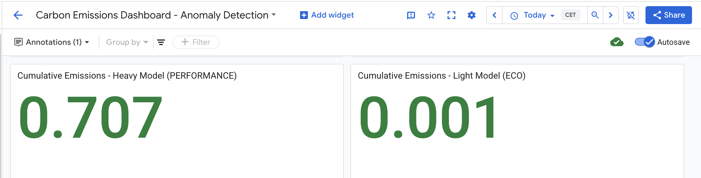
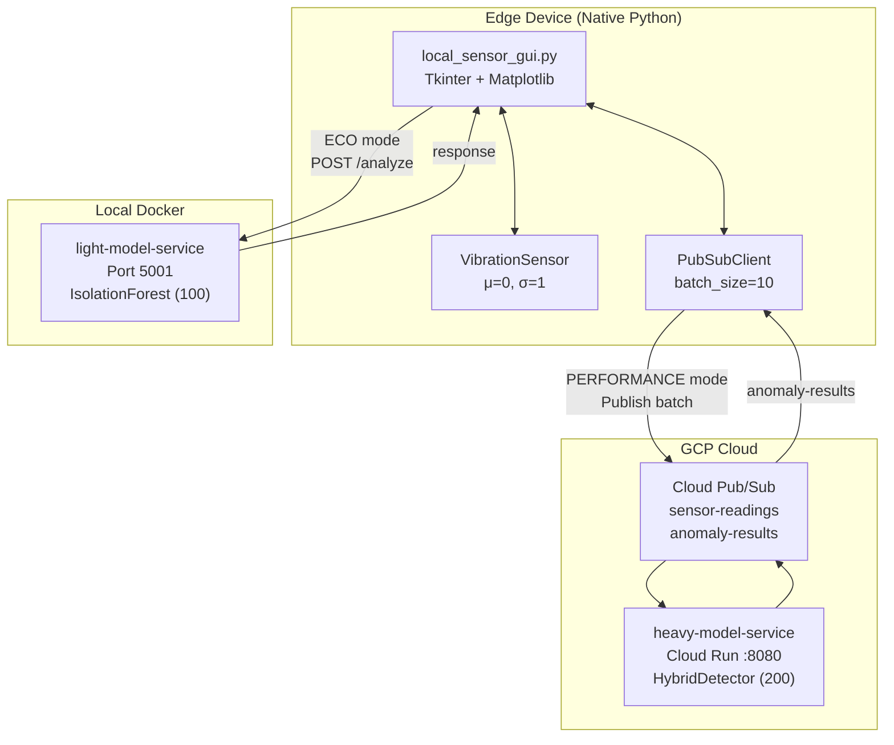
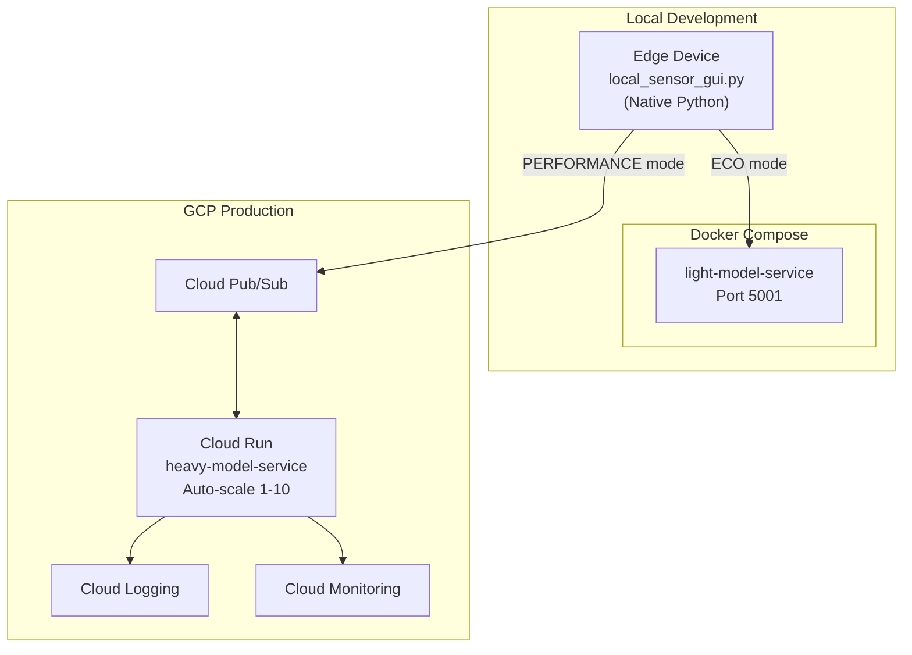
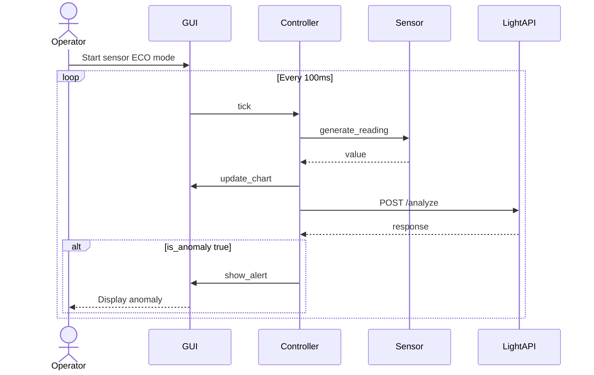
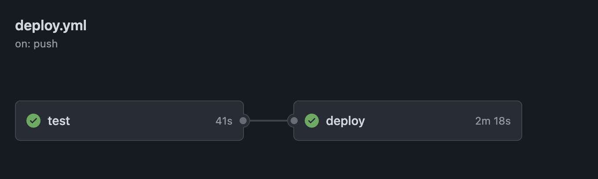
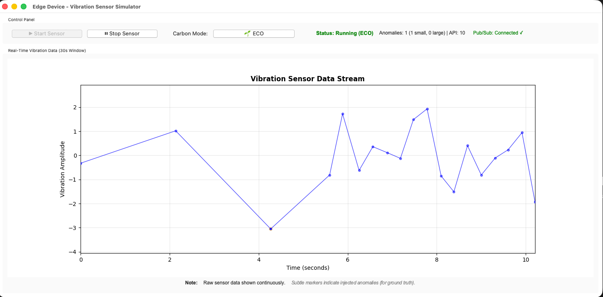

# Carbon-Aware IoT Anomaly Detection System

## Table of Contents

- [Project Overview](#project-overview)
- [Architecturally Significant Use Cases](#architecturally-significant-use-cases)
- [System Architecture](#system-architecture)
  - [Component Diagram](#component-diagram)
  - [Deployment Diagram](#deployment-diagram)
  - [Sequence Diagram](#sequence-diagram)
- [Current Implementation Status](#current-implementation-status)
- [Getting Started](#getting-started)
- [Technology Stack](#technology-stack)

---

## Project Overview

The **Carbon-Aware IoT Anomaly Detection System** is a hybrid edge-cloud platform for **industrial vibration sensor monitoring**. It detects mechanical anomalies (bearing failures, shaft imbalance, resonance issues) in rotating machinery by analyzing vibration amplitude signals.

### Signal Characteristics

The system processes vibration sensor readings with the following characteristics:
- **Normal operation:** Gaussian distribution (μ=0, σ=1)
- **Anomaly rate:** ~0.3% of readings (approximately 2 anomalies per minute at 10 Hz sampling)
- **Small anomalies:** 3.0σ to 4.0σ deviation (60% of anomalies)—early warning indicators
- **Large anomalies:** 5.0σ to 8.0σ deviation (40% of anomalies)—critical failures

### Dual-Mode Carbon-Aware Processing

The system implements two processing modes, manually selectable via GUI. Both modes use a **Hybrid ML approach** combining Isolation Forest with Z-score statistical detection:

1. **PERFORMANCE Mode:** Batches 10 readings and publishes to Google Cloud Pub/Sub for cloud inference using a **200-estimator Isolation Forest** + Z-score ensemble. Optimized for accuracy when cloud resources are available.

2. **ECO Mode:** Processes each reading locally via REST API (port 5001) using a **100-estimator Isolation Forest** + Z-score ensemble. Balances accuracy with reduced cloud compute.

### ML Detection Strategy

| Component | Isolation Forest | Z-Score | Ensemble Logic |
|-----------|-----------------|---------|----------------|
| Light (ECO) | 100 estimators | 3.0σ threshold | Flag if EITHER triggers |
| Heavy (PERFORMANCE) | 200 estimators | 3.0σ threshold | Flag if EITHER triggers |

**Warmup Phase:** First 100 samples use statistical-only detection while the Isolation Forest model trains on incoming data. After warmup, the full ensemble activates.

### Carbon Awareness

Mode switching is **always manual** (operator toggles via GUI). The system integrates **CodeCarbon** for carbon consumption measurement, providing:
- Per-inference carbon emission tracking (gCO₂e)
- Custom metrics exported to **GCP Cloud Monitoring** with service/mode labels
- Data-driven comparison of PERFORMANCE vs ECO carbon footprints
- Real-time visibility into the environmental impact of each processing mode



Note: Carbon measurement is for **observability only**—the system does not automatically switch modes based on carbon intensity.

#### Cloud Environment Carbon Estimation

When running on **GCP Cloud Run** or other containerized cloud environments, hardware power monitoring sensors are not accessible to application code. CodeCarbon relies on direct access to CPU/GPU power sensors (via tools like `powercap`, RAPL, or NVML), which are typically unavailable in:
- Containerized environments (Docker, Kubernetes)
- Serverless platforms (Cloud Run, Lambda, Cloud Functions)
- Virtual machines without privileged access

Additionally, CodeCarbon's blocking I/O operations when attempting to read unavailable hardware sensors can cause concurrent requests to hang in multi-threaded environments.

To ensure **reliability and observability**, the system uses **estimation-based carbon tracking** (disabled CodeCarbon by default in cloud):

**Estimation Methodology:**

| Parameter | Value | Rationale |
|-----------|-------|-----------|
| vCPU Power (TDP) | ~15W | Typical cloud instance vCPU allocation (Intel/AMD server processors) |
| Grid Carbon Intensity | ~0.1 kgCO₂e/kWh | Finland average (europe-north1 region - low carbon grid) |
| Inference Time | ~0.1s | Conservative estimate for ensemble ML prediction |
| **Per-inference emission** | **~0.005 mg CO₂e** | 15W × 0.1s = 1.5 Wh → 0.0000015 kWh × 0.1 = 0.00000015 kg |

**Why Finland's Grid?**
Finland (europe-north1) has one of the lowest carbon intensities in Europe (~100 gCO₂e/kWh) due to:
- 40% nuclear energy (low-carbon baseload)
- 40% renewable energy (hydro, wind, biomass)
- 20% fossil fuels

This estimation ensures the carbon dashboard displays realistic, non-zero values for cloud workloads while clearly indicating these are **estimates** rather than direct measurements.

**Enabling Real Measurements (Not Recommended):**
Set `CODECARBON_ENABLED=true` environment variable to enable actual CodeCarbon tracking. This may cause performance issues or hangs in cloud environments and is only suitable for local development with hardware access.

---

## Architecturally Significant Use Cases

### UC-1: Real-Time Vibration Monitoring

**Responsibilities:**
- Sample vibration sensor at 10 Hz (100ms intervals)
- Display 30-second sliding window (300 data points) in real-time GUI
- Detect anomalies within latency constraints per mode

**Quality Attributes:**
| Attribute | PERFORMANCE Mode | ECO Mode |
|-----------|------------------|----------|
| Sampling Rate | 10 readings/second | 10 readings/second |
| Detection Latency | 1-2 seconds (batch + cloud) | <100ms (local REST) |
| GUI Update | 100ms interval | 100ms interval |

**Constraints:**
- GUI window: 1200×700 pixels, Y-axis range: -10 to +10
- Maximum data points in memory: 300 (30-second window)

---

### UC-2: Cloud Batch Processing (PERFORMANCE Mode)

**Responsibilities:**
- Aggregate readings into batches of 10
- Publish to `sensor-readings` Pub/Sub topic
- Receive predictions from `anomaly-results` subscription
- Display anomaly alerts with confidence scores

**Quality Attributes:**
| Attribute | Value |
|-----------|-------|
| Batch Size | 10 readings |
| Publish Timeout | 5 seconds |
| Cloud Processing Timeout | 10 seconds |
| Confidence Score Range | 0.0 (normal) to 1.0 (anomalous) |

**Constraints:**
- Project ID: `local-project` (emulator) or GCP project
- Topics: `sensor-readings`, `anomaly-results`
- Subscription: `anomaly-results-sub`

---

### UC-3: Local Inference (ECO Mode)

**Responsibilities:**
- Send individual readings to local REST API
- Perform hybrid anomaly detection (Isolation Forest + Z-score ensemble)
- Return immediate prediction without cloud dependency

**Quality Attributes:**
| Attribute | Value |
|-----------|-------|
| API Endpoint | `POST /analyze` on localhost:5001 |
| Request Timeout | 2 seconds |
| Detection Method | Hybrid: Isolation Forest (100 estimators) + Z-score (3.0σ) |
| Ensemble Logic | Flag anomaly if EITHER detector triggers |
| Response Time | <50ms |
| Warmup Period | First 100 samples (statistical fallback) |

**Constraints:**
- Requires `light-model-service` container running
- First 100 samples use statistical-only detection during ML warmup

---

### UC-4: Mode Switching

**Responsibilities:**
- Allow operator to toggle between PERFORMANCE and ECO modes
- Flush pending batch when switching to ECO
- Verify light-model health when switching to ECO

**Quality Attributes:**
- Mode switch latency: <1 second
- Visual feedback: Mode indicator updates immediately

**Constraints:**
- Manual toggle only (all phases)
- Carbon measurement (Phase 4) is for observability, not automated switching

---

## System Architecture

### Component Diagram

The system consists of three main components working together:



#### Edge Device (Native Python)
- **local_sensor_gui.py**: Unified edge application combining:
  - Tkinter + Matplotlib visualization (1200×700, 100ms updates)
  - `VibrationSensor`: Generates readings (μ=0, σ=1, anomaly_rate=0.3%)
  - `PubSubClient`: Batches 10 readings, 5s publish timeout
  - `Application`: GUI with mode toggle (PERFORMANCE/ECO)

#### Light Model Service (Local Docker: port 5001)
- **Flask API**: `/health`, `/analyze`, `/analyze/batch`, `/stats`, `/reset`
- **IsolationForestDetector**: Sliding window features (50 samples), 100 estimators
- Runs locally via Docker Compose for ECO mode processing

#### Heavy Model Service (GCP Cloud Run: port 8080)
- **Pub/Sub Subscriber**: Listens to `sensor-readings-sub` in GCP
- **HybridAnomalyDetector**: Isolation Forest (200 estimators) + Z-score (3.0σ)
- **IsolationForestDetector**: Heavier model for cloud processing
- **AnomalyMonitor**: 60-second rolling window, Cloud Logging integration
- Deployed to GCP Cloud Run for PERFORMANCE mode (not included in local docker-compose)

#### Pub/Sub Topics
- `sensor-readings`: Edge → Cloud (batched readings)
- `anomaly-results`: Cloud → Edge (predictions with confidence)

---

### Deployment Diagram



#### Local Development Environment (Docker Compose)
| Container | Port Mapping | Health Check |
|-----------|--------------|---------------|
| `light-model-service` | 5001:5000 | 10s interval, 5 retries |

Network: `carbon-aware-network`

**Note:** Only the light-model-service runs locally via Docker Compose. The heavy-model-service and Pub/Sub run in GCP (see [docs/GCP_SETUP.md](docs/GCP_SETUP.md)).

#### Production GCP Environment
- **Cloud Run**: Auto-scaling 1-10 instances (min 1 for Pub/Sub pull), 512MB memory
- **Cloud Pub/Sub**: Managed broker (99.9% SLA)
- **Artifact Registry**: Docker image storage
- **Cloud Logging**: Structured JSON logs
- **Cloud Monitoring**: `anomaly_detection/rate` custom metric

#### Edge Deployment
- Raspberry Pi or similar devices running edge Python application
- Connects to local containers (dev) or GCP services (prod)

---

### Sequence Diagram

The following diagram shows the main interaction flow for ECO mode (local inference):



For PERFORMANCE mode, readings are batched (10 readings) and sent via Pub/Sub to the cloud heavy-model-service, which returns predictions asynchronously.

See [plans/sequence.md](plans/sequence.md) for complete sequence diagrams covering:
- System initialization
- PERFORMANCE mode flow (batch → Pub/Sub → cloud inference)
- ECO mode flow (individual → REST → local inference)
- Mode toggle interaction
- ML warmup sequence

### Class Diagram

See [plans/class.md](plans/class.md) for class definitions including:
- `CarbonAwareController`, `SensorSimulator`, `PubSubClient`
- `HybridAnomalyDetector` (ensemble coordinator)
- `IsolationForestDetector` (window_size=50, n_estimators=100/200)
- `StatisticalAnomalyDetector` (z_threshold=3.0)
- `LightModelAPI`, `HeavyModelService`, `AnomalyMonitor`

---

## Current Implementation Status

### ✅ Phase 1: Core Infrastructure (Completed)

- [x] **Edge Device Simulator**
  - Realistic vibration sensor data generation (normal distribution μ=0, σ=1)
  - Configurable anomaly injection (3-4σ small, 5-8σ large)
  - Real-time GUI with Tkinter and Matplotlib
  - Mode toggle between PERFORMANCE and ECO

- [x] **Hybrid ML Detection Pipeline**
  - `IsolationForestDetector`: Sliding window (50 samples), online training
  - `StatisticalAnomalyDetector`: Z-score threshold (3.0σ)
  - `HybridAnomalyDetector`: Ensemble combining both (flag if EITHER triggers)
  - Light model: 100 estimators for ECO mode
  - Heavy model: 200 estimators for PERFORMANCE mode
  - Warmup phase: First 100 samples use statistical fallback

- [x] **Local Light Model Service**
  - Flask REST API with `/predict`, `/analyze`, `/analyze/batch`, `/stats`, `/reset`
  - Hybrid ML detection with online training
  - Docker containerization with health checks

### 🏗️ Phase 2: Cloud Integration (Completed)

- [x] **Google Cloud Pub/Sub Integration**
  - `PubSubClient` class with automatic batching (10 readings)
  - Subscription callback for anomaly results
  - Local emulator for development
  - Connection retry logic and error handling

- [x] **Heavy Model Service**
  - Pub/Sub subscriber for `sensor-readings` topic
  - Hybrid ML detection (200-estimator Isolation Forest + Z-score)
  - Result publishing to `anomaly-results` topic
  - Confidence scoring with ensemble agreement
  - Flask health check endpoint on port 8080

- [x] **Cloud Monitoring & Logging**
  - Structured JSON logging to Cloud Logging
  - 60-second rolling window anomaly rate
  - Custom metric `anomaly_detection/rate` to Cloud Monitoring
  - Graceful degradation when Cloud APIs unavailable

- [x] **Deployment Infrastructure**
  - `Dockerfile.heavy` for Cloud Run deployment
  - `Dockerfile.light` for local deployment
  - `docker-compose.yml` with Pub/Sub emulator
  - `pubsub-init.sh` for topic/subscription setup
  - `cloudbuild.yaml` for CI/CD pipeline
  - Complete GCP setup documentation
  - Service account setup documentation with required IAM roles

### ✅ Phase 3: CI/CD & Testing (Completed)

- [x] **GitHub Actions Workflow**
  - Automated test and deploy pipeline (`.github/workflows/deploy.yml`)
  - Runs unit tests on every push to any branch
  - Deploys to Cloud Run only on `main` branch
  - Workload Identity Federation for secure GCP authentication
  - Python 3.11 environment with dependency caching



- [x] **Cloud Build Pipeline**
  - Cloud Build configuration (`cloudbuild.yaml`) for GCP-native CI/CD
  - Multi-step pipeline: Build → Push → Deploy → Verify health
  - Automatic deployment to Cloud Run on `europe-north1`
  - Artifact Registry integration for Docker images
  - Build timeout and error handling

- [x] **Testing Suite**
  - pytest-based testing framework with shared fixtures
  - Unit tests for all core components:
    - `test_hybrid_detector.py`: Ensemble detector tests
    - `test_isolation_forest_detector.py`: ML model tests
    - `test_statistical_model.py`: Z-score detector tests
    - `test_carbon_monitoring.py`: Carbon tracking tests
    - `test_light_api.py`: Light model API tests
    - `test_heavy_api.py`: Heavy model API tests
  - Mock-based testing for GCP dependencies
  - Configurable fixtures for normal/anomaly readings

### ✅ Phase 4: Carbon Awareness (Completed)

- [x] **CodeCarbon Integration**
  - `CarbonMonitor` class wrapping CodeCarbon EmissionsTracker
  - Per-inference carbon emission tracking
  - Context manager for easy tracking: `with monitor.track_inference():`
  - Configurable country/region for carbon intensity

- [x] **GCP Cloud Monitoring Export**
  - Custom metric descriptors: `carbon/emissions_gco2e`, `carbon/total_emissions_gco2e`, `carbon/inference_count`
  - Labels by service (`heavy-model`/`light-model`) and mode (`PERFORMANCE`/`ECO`)
  - Background reporter thread for periodic metric export (60s intervals)
  - Graceful degradation when Cloud Monitoring unavailable

#### ⚠️ Scaling Constraints

**Current Configuration: Sequential Processing Only**

The heavy-model-service is deployed with `--max-instances=1 --concurrency=1` to enforce sequential batch processing. This is required because:

- **Google Cloud Monitoring GAUGE metrics** have a **60-second minimum sampling interval**
- Multiple concurrent instances would attempt to write metrics within the same time window, causing "Points must be written in order" errors
- Each Cloud Run instance runs independently with its own worker thread, making distributed coordination difficult

**To Enable Horizontal Scaling:**

If an alternative monitoring strategy is implemented (e.g., aggregating metrics in a dedicated service, using COUNTER metrics instead of GAUGE, or disabling Cloud Monitoring integration), it is easy scale the service by adjusting the Cloud Run configuration:

```yaml
# In deployment/gcp/cloudbuild.yaml and .github/workflows/deploy.yml
--max-instances=10        # Allow up to 10 concurrent instances
--concurrency=80          # Handle 80 concurrent requests per instance
--timeout=300             # Keep generous timeout for batch processing
```

This would enable the service to process multiple batches in parallel across different instances, significantly improving throughput.

---

## Getting Started

### Prerequisites

- Docker and Docker Compose
- Python 3.11+
- Google Cloud SDK (for GCP deployment)
- Git

### Quick Start (5 minutes)

1. **Clone and Setup**
   ```bash
   git clone <repository-url>
   cd FinalProject
   pip install -r requirements.txt
   ```

2. **Generate Training Data & Train Models**
   ```bash
   cd models
   python data/generate_training_data.py  # Creates training_data.csv and validation_data.csv
   python train_models.py                  # Trains and evaluates both models
   ```
   
   This will:
   - Generate synthetic vibration sensor data with realistic anomalies
   - Train the Heavy Model (HybridAnomalyDetector, 200 estimators)
   - Train the Light Model (IsolationForestDetector, 50 estimators)
   - Evaluate both models on the validation set
   - Save models as `model_heavy.pkl` and `model_light.pkl`

3. **Run Tests**
   ```bash
   cd tests
   pip install -r test_requirements.txt
   pytest unit/ -v
   ```

4. **Start Services**
   ```bash
   docker-compose up -d
   ```

5. **Run Edge Device**
   ```bash
   cd services/edge
   pip install -r requirements.txt
   export ML_API_URL=http://localhost:5001
   python local_sensor_gui.py
   ```

6. **Use the Application**
   - Click "▶ Start Sensor"
   - Watch real-time sensor data visualization
   - Toggle between PERFORMANCE and ECO modes
   - View anomaly alerts and confidence scores
   - View logs: `docker-compose logs -f`



### Deploy to GCP

See [docs/GCP_SETUP.md](docs/GCP_SETUP.md) for complete deployment instructions.

Quick deploy:
```bash
# Enable APIs and create Pub/Sub resources (one-time)
gcloud services enable pubsub.googleapis.com run.googleapis.com
./deployment/gcp/pubsub-init.sh

# Deploy heavy model
gcloud builds submit --config=deployment/gcp/cloudbuild.yaml
```

---

## Technology Stack

### Edge Device
- **Python 3.11**: Core application language
- **Tkinter**: GUI framework
- **Matplotlib**: Real-time data visualization
- **google-cloud-pubsub**: Pub/Sub client library

### ML Models
- **scikit-learn**: Isolation Forest implementation
- **NumPy**: Numerical operations
- **joblib**: Model serialization

### Services
- **Flask**: REST API framework
- **Docker**: Container runtime
- **Docker Compose**: Local orchestration

### Cloud Infrastructure (GCP)
- **Cloud Run**: Serverless container platform
- **Cloud Pub/Sub**: Asynchronous messaging
- **Cloud Build**: CI/CD automation
- **Artifact Registry**: Container registry
- **Cloud Logging**: Log management
- **Cloud Monitoring**: Metrics and alerting

### Development Tools
- **pytest**: Testing framework with fixtures and mocks
- **Cloud Build**: CI/CD automation for GCP deployment
- **CodeCarbon**: Carbon emissions tracking library
- **Mermaid**: Architecture diagrams (GitHub-native rendering)

---

## Project Structure

```
FinalProject/
├── services/
│   ├── edge/                    # Edge device application
│   │   ├── local_sensor_gui.py  # Unified GUI + sensor + Pub/Sub
│   │   └── requirements.txt
│   ├── common/                  # Shared utilities
│   │   └── carbon_monitoring.py # Carbon emissions tracking
│   ├── light-model/             # Local REST API service (ECO mode)
│   │   ├── api_service.py
│   │   └── requirements.txt
│   └── heavy-model/             # Cloud Pub/Sub service (PERFORMANCE mode)
│       ├── api_service.py
│       ├── monitoring.py
│       └── requirements.txt
├── deployment/
│   ├── docker/                  # Dockerfiles
│   │   ├── Dockerfile.light
│   │   └── Dockerfile.heavy
│   └── gcp/                     # GCP deployment configs
│       ├── cloudbuild.yaml      # CI/CD pipeline configuration
│       ├── carbon-dashboard.json # Cloud Monitoring dashboard
│       └── pubsub-init.sh
├── models/                      # ML model training
│   ├── train_models.py          # Training pipeline with validation
│   ├── hybrid_detector.py       # Ensemble detector (ML + Z-score)
│   ├── isolation_forest_detector.py
│   ├── statistical_model.py
│   └── data/
│       ├── generate_training_data.py  # Synthetic data generator
│       ├── training_data.csv
│       └── validation_data.csv
├── tests/                       # Test suite
│   ├── conftest.py              # Shared fixtures
│   ├── test_requirements.txt
│   └── unit/                    # Unit tests
│       ├── test_carbon_monitoring.py
│       ├── test_hybrid_detector.py
│       ├── test_isolation_forest_detector.py
│       ├── test_statistical_model.py
│       ├── test_light_api.py
│       └── test_heavy_api.py
├── .github/
│   └── workflows/
│       └── deploy.yml           # GitHub Actions CI/CD pipeline
├── assets/                      # Images and screenshots
│   ├── gui.png                  # Edge device GUI screenshot
│   ├── github_action.png        # CI/CD pipeline screenshot
│   └── cloud_monitor_dashboard.png
├── docs/                        # Documentation
│   └── GCP_SETUP.md            # Cloud deployment guide
├── plans/                       # Architecture diagrams (Mermaid)
├── docker-compose.yml          # Local light-model service
└── README.md                   # This file
```
