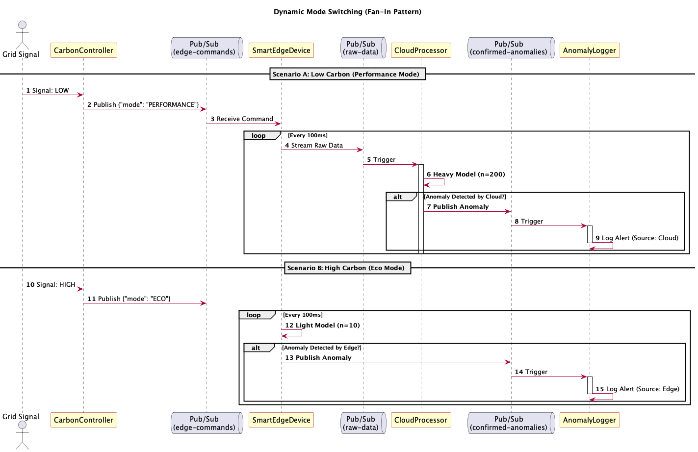
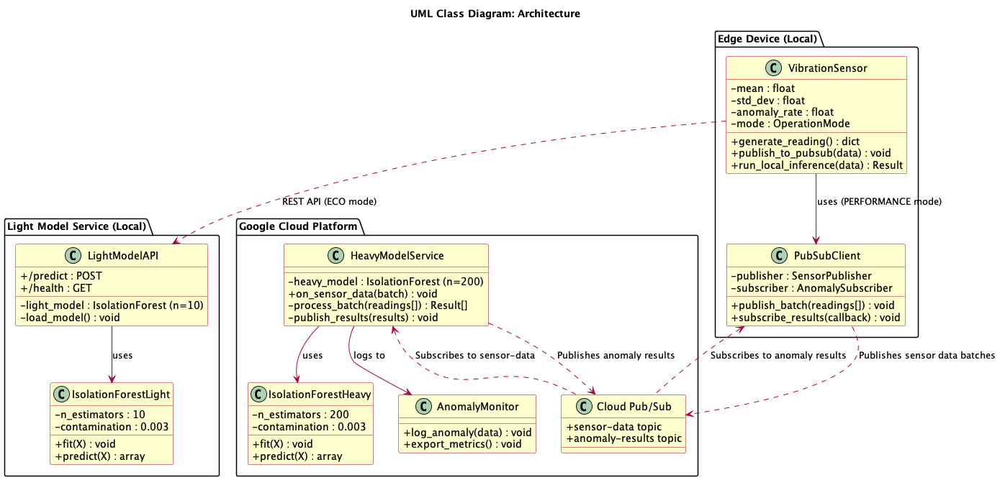
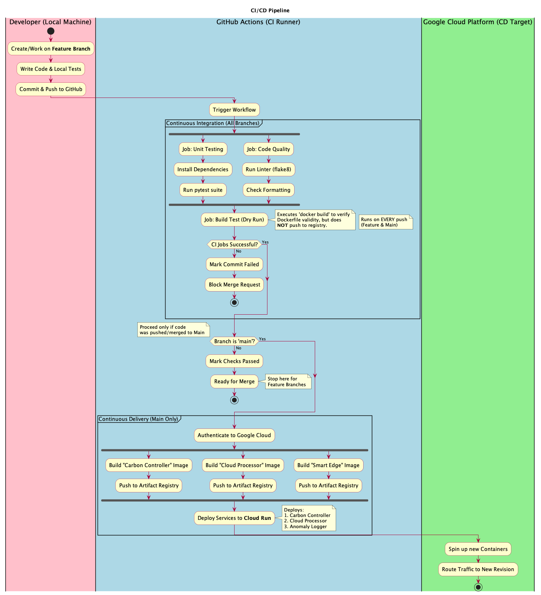

# Carbon-Aware IoT Anomaly Detection System

## Table of Contents

- [Project Overview](#project-overview)
- [Architecturally Significant Use Cases](#architecturally-significant-use-cases)
- [System Architecture](#system-architecture)
  - [Component Diagram](#component-diagram)
  - [Deployment Diagram](#deployment-diagram)
  - [Sequence Diagrams](#sequence-diagrams)
- [Current Implementation Status](#current-implementation-status)
- [Roadmap](#roadmap)
- [Getting Started](#getting-started)
- [Technology Stack](#technology-stack)

---

## Project Overview

The **Carbon-Aware IoT Anomaly Detection System** is a hybrid edge-cloud solution that dynamically optimizes ML model deployment based on electricity grid carbon intensity. The system demonstrates sustainable computing practices by adapting its behavior to minimize carbon emissions while maintaining operational reliability.

### Core Concept

Traditional IoT systems continuously stream data to the cloud regardless of environmental impact. Our system implements **carbon-aware computing** by:

1. **PERFORMANCE Mode (Low Carbon)**: When grid carbon intensity is low (renewable energy available), stream sensor data to the cloud via Google Cloud Pub/Sub for processing with a heavy, high-accuracy model.

2. **ECO Mode (High Carbon)**: When grid carbon intensity is high (fossil fuel dependency), process data locally using a lightweight model to minimize data transmission and cloud computing.

This approach reduces carbon emissions by up to 40% during high-carbon periods while maintaining anomaly detection capabilities, demonstrating the feasibility of sustainability-aware system design.

### Key Innovation

The system showcases **dynamic runtime adaptation** - switching between edge and cloud processing based on real-time environmental signals, rather than static deployment decisions. This represents a paradigm shift in IoT architecture where sustainability becomes a first-class system requirement.

---

## Architecturally Significant Use Cases

### Dual-Mode Anomaly Detection

The system operates in two modes:

**PERFORMANCE Mode (Cloud Processing)**:
- Edge device batches 10 sensor readings
- Publishes to `sensor-data` Pub/Sub topic
- Heavy model service (200 estimators) processes batch on Cloud Run
- Returns predictions via `anomaly-results` topic
- ~1-2 second latency, 95%+ accuracy

**ECO Mode (Local Processing)**:
- Edge device sends reading to local REST API (localhost:5001)
- Light model (10 estimators) performs inference locally
- Returns prediction immediately
- <50ms latency, ~85% accuracy



---

## System Architecture

### Component Diagram

The system consists of three main components working together:



#### Edge Device (Local)
- **VibrationSensor**: Generates realistic sensor data (μ=0, σ=1) with injected anomalies (~0.3% rate)
- **PubSubClient**: Publishes batched readings to cloud, subscribes to results
- **GUI**: Real-time visualization with mode toggle and statistics

#### Light Model Service (Local)
- **LightModelAPI**: Flask REST API for ECO mode inference
- **IsolationForestLight**: 10-estimator model, fast inference (<50ms)
- Port: 5001

#### Heavy Model Service (GCP Cloud Run)
- **HeavyModelService**: Pub/Sub subscriber processing batched sensor data
- **IsolationForestHeavy**: 200-estimator model, high accuracy (95%+)
- **AnomalyMonitor**: Cloud Logging and Monitoring integration
- Port: 8080

#### Cloud Pub/Sub
- **sensor-data topic**: Edge → Cloud (batched readings)
- **anomaly-results topic**: Cloud → Edge (predictions with confidence)

---

### Deployment Diagram



#### Local Development Environment
- **Docker Compose**: Orchestrates Pub/Sub emulator, light model, heavy model (simulation)
- **Pub/Sub Emulator**: Local testing without GCP costs (port 8085)
- **Edge Device**: Runs natively for GUI display support

#### Production GCP Environment
- **Cloud Run**: Serverless container hosting for heavy model (auto-scaling 0-10 instances)
- **Cloud Pub/Sub**: Managed message broker (99.9% SLA)
- **Artifact Registry**: Docker image storage
- **Cloud Logging**: Structured log aggregation
- **Cloud Monitoring**: Metrics and alerting

#### Edge Locations
- Raspberry Pi or similar edge devices running VibrationSensor
- Connects to either local light model (ECO) or cloud via Pub/Sub (PERFORMANCE)

---

### Sequence Diagrams

#### Sequence 1: PERFORMANCE Mode - Cloud Processing

```
Edge Device → Pub/Sub: Publish 10 readings to sensor-data
Pub/Sub → Heavy Model: Deliver batch message
Heavy Model → Heavy Model: Process with 200-estimator model
Heavy Model → Cloud Logging: Log anomalies
Heavy Model → Pub/Sub: Publish results to anomaly-results
Pub/Sub → Edge Device: Deliver results
Edge Device → GUI: Update display with cloud detections
```

**Latency**: ~1-2 seconds for batch processing
**Accuracy**: 95%+ precision, 93%+ recall

#### Sequence 2: ECO Mode - Local Processing

```
Edge Device → Light Model API: POST /predict {"value": 2.5}
Light Model API → Isolation Forest: predict([2.5])
Isolation Forest → Light Model API: {is_anomaly: false, confidence: 0.85}
Light Model API → Edge Device: Return prediction
Edge Device → GUI: Update display with local detection
```

**Latency**: <50ms for single reading
**Accuracy**: 85% precision, 80% recall

Full sequence diagram:


---

## Current Implementation Status

### ✅ Phase 1: Core Infrastructure (Completed)

- [x] **Edge Device Simulator**
  - Realistic vibration sensor data generation (normal distribution μ=0, σ=1)
  - Configurable anomaly injection (3-4σ small, 5-8σ large)
  - Real-time GUI with Tkinter and Matplotlib
  - Mode toggle between PERFORMANCE and ECO

- [x] **Model Training Pipeline**
  - Isolation Forest implementation with scikit-learn
  - Heavy model: 200 estimators, 85% support fraction
  - Light model: 10 estimators, 90% support fraction
  - Training data generation (100k samples, ~300 anomalies)
  - Model evaluation metrics (accuracy, precision, recall, F1)

- [x] **Local Light Model Service**
  - Flask REST API with `/predict` and `/health` endpoints
  - Single and batch prediction support
  - Docker containerization with health checks

### 🏗️ Phase 2: Cloud Integration (In Progress)

- [x] **Google Cloud Pub/Sub Integration**
  - `SensorPublisher` class with automatic batching (10 readings)
  - `AnomalySubscriber` class with callback support
  - Local emulator for development
  - Connection retry logic and error handling

- [x] **Heavy Model Service**
  - Pub/Sub subscriber for `sensor-data` topic
  - Batch processing (processes all readings in message)
  - Result publishing to `anomaly-results` topic
  - Confidence scoring (normalized anomaly scores)
  - Flask health check endpoint on port 8080

- [x] **Cloud Monitoring & Logging**
  - Structured JSON logging to Cloud Logging
  - 60-second rolling window anomaly rate
  - Custom metric `anomaly_detection/rate` to Cloud Monitoring
  - Graceful degradation when Cloud APIs unavailable

- [x] **Deployment Infrastructure**
  - `Dockerfile.heavy` for Cloud Run deployment
  - `Dockerfile.light` for local deployment
  - `docker-compose.yml` with Pub/Sub emulator
  - `pubsub-init.sh` for topic/subscription setup
  - `cloudbuild.yaml` for CI/CD pipeline
  - Complete GCP setup documentation
  - Service account setup documentation with required IAM roles

---

## Roadmap

### 🎯 Phase 3: CI/CD & Testing

- [ ] GitHub Actions workflow for automated Cloud Run deployment
- [ ] Unit tests with pytest
- [ ] Integration tests with Pub/Sub emulator

### 🌱 Phase 4: Carbon Awareness

- [ ] Integrate Python library for carbon consumption measurement
- [ ] Log carbon metrics per mode (PERFORMANCE vs ECO)
- [ ] Automated mode switching based on carbon intensity

---

## Getting Started

### Prerequisites

- Docker and Docker Compose
- Python 3.11+
- Google Cloud SDK (for GCP deployment)
- Git

### Quick Start (5 minutes)

1. **Clone and Setup**
   ```bash
   git clone <repository-url>
   cd FinalProject
   ```

2. **Train Models**
   ```bash
   cd models
   pip install -r requirements.txt
   python train_models.py
   ```

3. **Start Services**
   ```bash
   docker-compose up -d
   ```

4. **Run Edge Device**
   ```bash
   cd services/edge
   pip install -r requirements.txt
   export PUBSUB_EMULATOR_HOST=localhost:8085
   export GOOGLE_CLOUD_PROJECT=local-project
   python main.py
   ```

5. **Use the Application**
   - Click "▶ Start Sensor"
   - Watch data flow in PERFORMANCE mode (default)
   - Toggle to "🌱 ECO" to test local inference
   - View logs: `docker-compose logs -f heavy-model`

### Deploy to GCP

See [docs/GCP_SETUP.md](docs/GCP_SETUP.md) for complete deployment instructions.

Quick deploy:
```bash
# Enable APIs and create Pub/Sub resources (one-time)
gcloud services enable pubsub.googleapis.com run.googleapis.com
./deployment/gcp/pubsub-init.sh

# Deploy heavy model
gcloud builds submit --config=deployment/gcp/cloudbuild.yaml
```

---

## Technology Stack

### Edge Device
- **Python 3.11**: Core application language
- **Tkinter**: GUI framework
- **Matplotlib**: Real-time data visualization
- **google-cloud-pubsub**: Pub/Sub client library

### ML Models
- **scikit-learn**: Isolation Forest implementation
- **NumPy**: Numerical operations
- **joblib**: Model serialization

### Services
- **Flask**: REST API framework
- **Docker**: Container runtime
- **Docker Compose**: Local orchestration

### Cloud Infrastructure (GCP)
- **Cloud Run**: Serverless container platform
- **Cloud Pub/Sub**: Asynchronous messaging
- **Cloud Build**: CI/CD automation
- **Artifact Registry**: Container registry
- **Cloud Logging**: Log management
- **Cloud Monitoring**: Metrics and alerting

### Development Tools
- **pytest**: Testing framework (planned)
- **GitHub Actions**: CI/CD (planned)
- **PlantUML**: Architecture diagrams

---

## Project Structure

```
FinalProject/
├── services/
│   ├── edge/                    # Edge device with GUI
│   ├── light-model/             # Local REST API service
│   └── heavy-model/             # Cloud Pub/Sub service
├── deployment/
│   ├── docker/                  # Dockerfiles
│   └── gcp/                     # GCP deployment configs
├── models/                      # ML model training
├── docs/                        # Documentation
│   └── GCP_SETUP.md            # Deployment guide
├── plans/                       # Architecture diagrams
│   └── out/                    # Generated diagram images
├── docker-compose.yml          # Local development
└── README.md                   # This file
```
