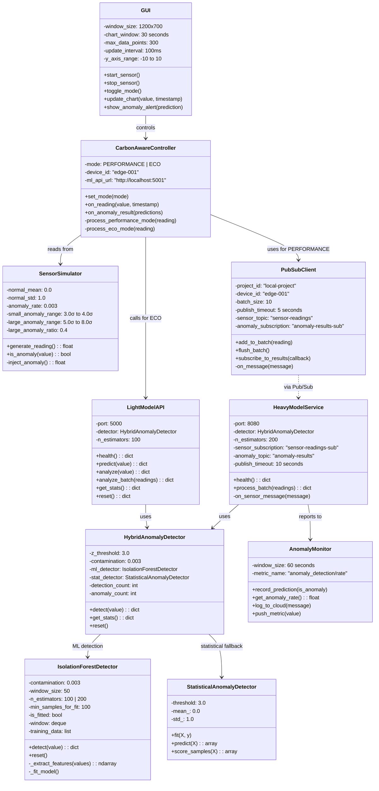
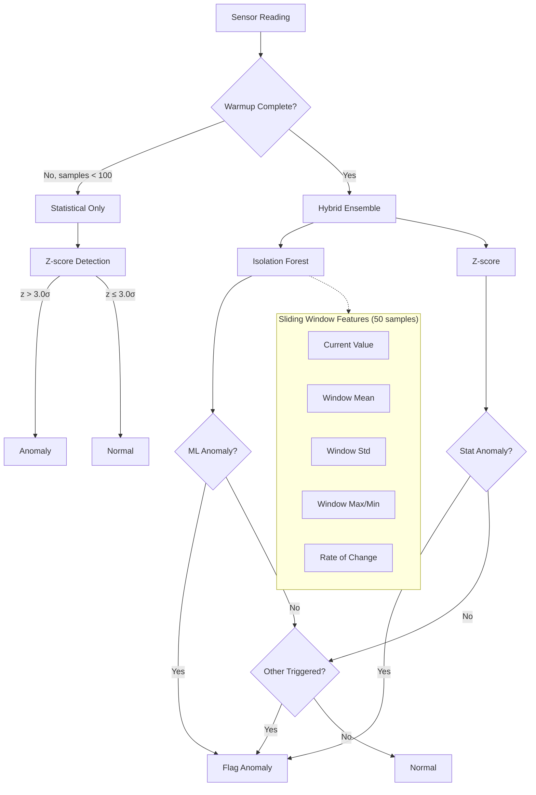
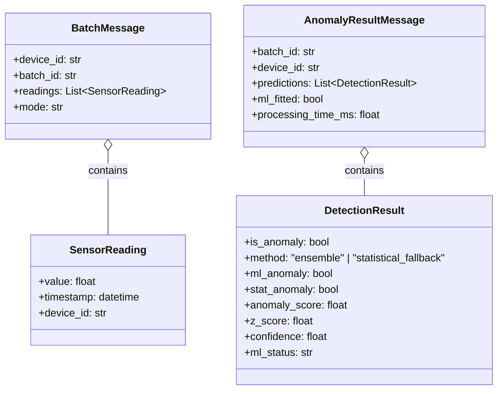

# Class Diagram

## Core Classes

## ML Detection Flow

## Data Classes

## Model Configuration

| Model | Location | Estimators | Window | Contamination | Warmup |
|-------|----------|------------|--------|---------------|--------|
| Light (ECO) | Docker :5001 | 100 | 50 | 0.003 | 100 samples |
| Heavy (Cloud) | Cloud Run :8080 | 200 | 50 | 0.003 | 100 samples |

| Detection Method | Threshold | Fallback | Ensemble Logic |
|------------------|-----------|----------|----------------|
| Isolation Forest | contamination=0.003 | N/A | Flag if score indicates anomaly |
| Z-score | 3.0σ | Primary during warmup | Flag if z > threshold |
| Hybrid | N/A | Stat-only first 100 samples | Flag if EITHER triggers |
