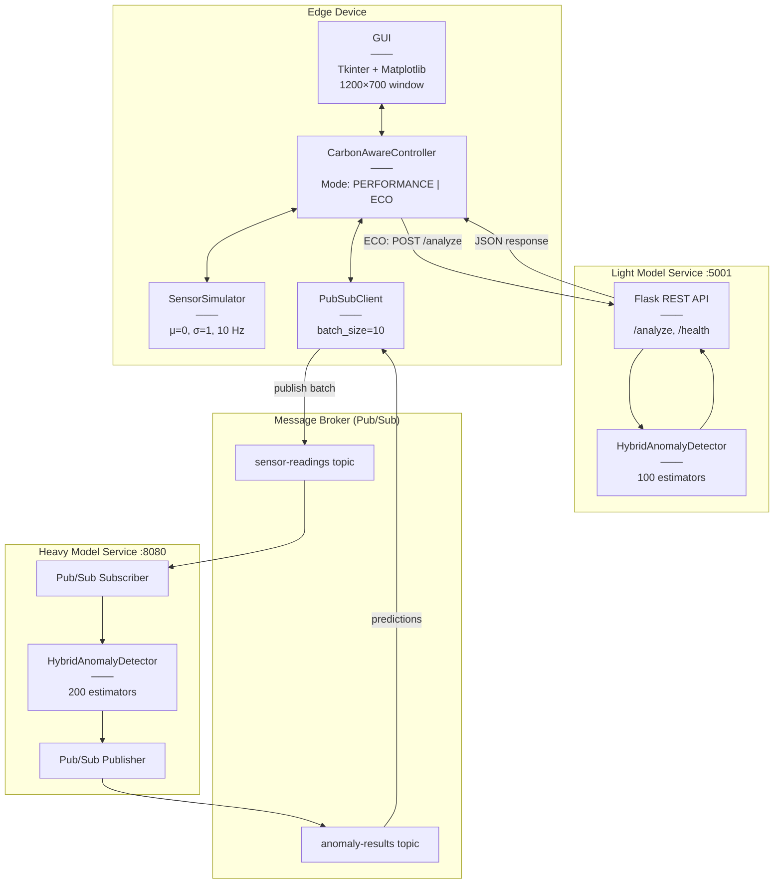
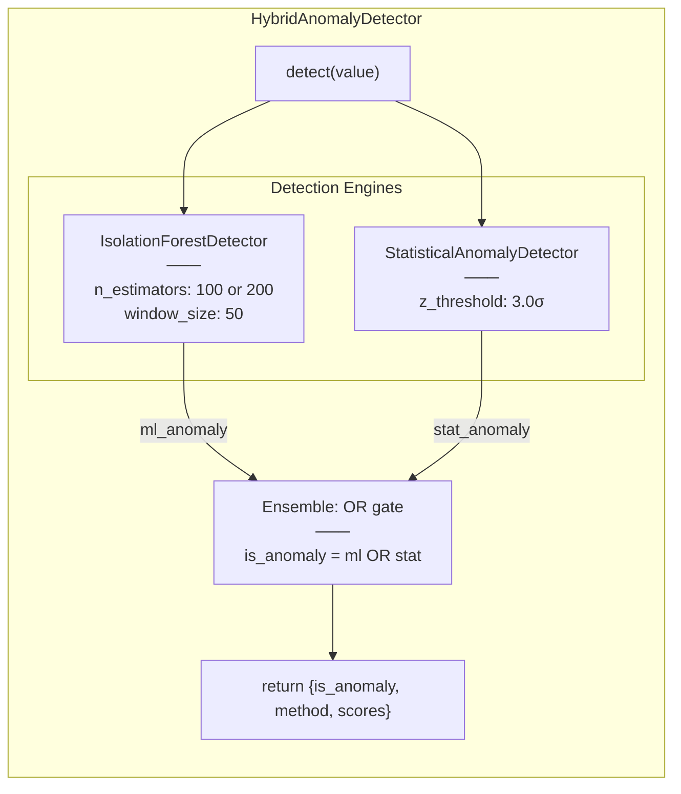

# Component Diagram

This document describes the logical component architecture of the Carbon-Aware IoT Anomaly Detection System.

---

## System Components Overview

---

## ML Detector Component Structure

---

## Component-to-Code Mapping

| Component | Source File | Description |
|-----------|-------------|-------------|
| GUI | \`services/edge/local_sensor_gui.py\` | Tkinter GUI class with Matplotlib chart |
| CarbonAwareController | \`services/edge/local_sensor_gui.py\` | Mode switching and orchestration logic |
| SensorSimulator | \`services/edge/local_sensor_gui.py\` | Gaussian sensor with anomaly injection |
| PubSubClient | \`services/edge/local_sensor_gui.py\` | Pub/Sub publish/subscribe wrapper |
| LightModelAPI | \`services/light-model/api_service.py\` | Flask REST endpoints |
| HeavyModelAPI | \`services/heavy-model/api_service.py\` | Flask health + Pub/Sub subscriber |
| HybridAnomalyDetector | \`models/hybrid_detector.py\` | Ensemble detector orchestration |
| IsolationForestDetector | \`models/isolation_forest_detector.py\` | Online-trained Isolation Forest |
| StatisticalAnomalyDetector | \`models/statistical_model.py\` | Z-score threshold detector |

---

## Interface Definitions

### Light Model REST API (Port 5001)

| Endpoint | Method | Request | Response |
|----------|--------|---------|----------|
| \`/health\` | GET | - | \`{"status": "healthy", "detector": "hybrid", "ml_fitted": bool}\` |
| \`/analyze\` | POST | \`{"value": float}\` | \`{"is_anomaly": bool, "method": str, "anomaly_score": float, "z_score": float}\` |
| \`/analyze/batch\` | POST | \`{"readings": [{value, timestamp}]}\` | \`{"summary": {...}, "results": [...]}\` |
| \`/stats\` | GET | - | \`{"total_detections": int, "anomaly_rate": float, "ml_fitted": bool}\` |
| \`/reset\` | POST | - | \`{"status": "reset"}\` |

### Heavy Model Service (Port 8080)

| Endpoint | Method | Purpose |
|----------|--------|---------|
| \`/health\` | GET | Health check with ML status for Cloud Run |
| \`/\` | GET | Service info with detector configuration |

### Pub/Sub Message Formats

| Topic | Direction | Message Format |
|-------|-----------|----------------|
| \`sensor-readings\` | Edge → Cloud | \`{"device_id": str, "readings": [{value, timestamp}], "batch_id": str}\` |
| \`anomaly-results\` | Cloud → Edge | \`{"batch_id": str, "predictions": [{is_anomaly, method, scores}], "ml_fitted": bool}\` |
