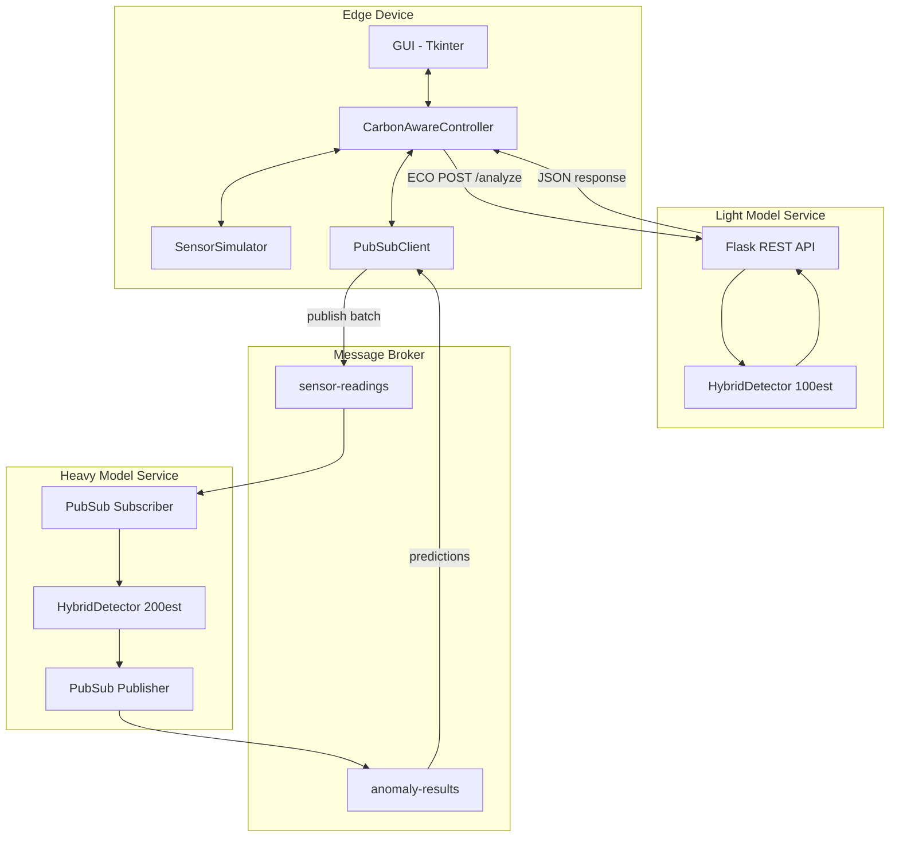
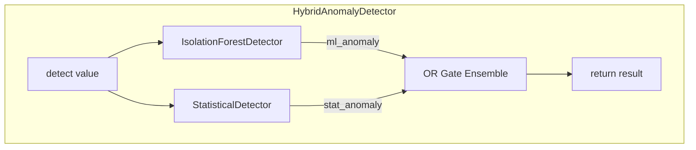

# Component Diagram

This document describes the logical component architecture of the Carbon-Aware IoT Anomaly Detection System.

---

## System Components Overview

**Component Details:**

| Component | Port | Description |
|-----------|------|-------------|
| GUI | - | Tkinter + Matplotlib, 1200x700 window |
| Controller | - | Mode switching: PERFORMANCE or ECO |
| Sensor | - | Gaussian noise (mean=0, std=1), 10 Hz |
| PubSubClient | - | Batches 10 readings for cloud |
| Light API | 5001 | Flask REST: /analyze, /health |
| Light Detector | - | 100 estimators + Z-score |
| Heavy Detector | 8080 | 200 estimators + Z-score |

---

## ML Detector Component Structure

**Detector Configuration:**

| Detector | Light Model | Heavy Model |
|----------|-------------|-------------|
| IsolationForest | 100 estimators | 200 estimators |
| Window Size | 50 samples | 50 samples |
| Z-score Threshold | 3.0 sigma | 3.0 sigma |
| Ensemble Logic | OR gate | OR gate |

---

## Component-to-Code Mapping

| Component | Source File | Description |
|-----------|-------------|-------------|
| GUI | `services/edge/local_sensor_gui.py` | Tkinter GUI class with Matplotlib chart |
| CarbonAwareController | `services/edge/local_sensor_gui.py` | Mode switching and orchestration logic |
| SensorSimulator | `services/edge/local_sensor_gui.py` | Gaussian sensor with anomaly injection |
| PubSubClient | `services/edge/local_sensor_gui.py` | Pub/Sub publish/subscribe wrapper |
| LightModelAPI | `services/light-model/api_service.py` | Flask REST endpoints |
| HeavyModelAPI | `services/heavy-model/api_service.py` | Flask health + Pub/Sub subscriber |
| HybridAnomalyDetector | `models/hybrid_detector.py` | Ensemble detector orchestration |
| IsolationForestDetector | `models/isolation_forest_detector.py` | Online-trained Isolation Forest |
| StatisticalAnomalyDetector | `models/statistical_model.py` | Z-score threshold detector |

---

## Interface Definitions

### Light Model REST API (Port 5001)

| Endpoint | Method | Request | Response |
|----------|--------|---------|----------|
| `/health` | GET | - | `{"status": "healthy", "ml_fitted": bool}` |
| `/analyze` | POST | `{"value": float}` | `{"is_anomaly": bool, "method": str, "scores": {...}}` |
| `/analyze/batch` | POST | `{"readings": [...]}` | `{"summary": {...}, "results": [...]}` |
| `/stats` | GET | - | `{"total_detections": int, "anomaly_rate": float}` |
| `/reset` | POST | - | `{"status": "reset"}` |

### Heavy Model Service (Port 8080)

| Endpoint | Method | Purpose |
|----------|--------|---------|
| `/health` | GET | Health check for Cloud Run |
| `/` | GET | Service info |

### Pub/Sub Message Formats

| Topic | Direction | Message Format |
|-------|-----------|----------------|
| `sensor-readings` | Edge to Cloud | `{"device_id": str, "readings": [...], "batch_id": str}` |
| `anomaly-results` | Cloud to Edge | `{"batch_id": str, "predictions": [...], "ml_fitted": bool}` |
