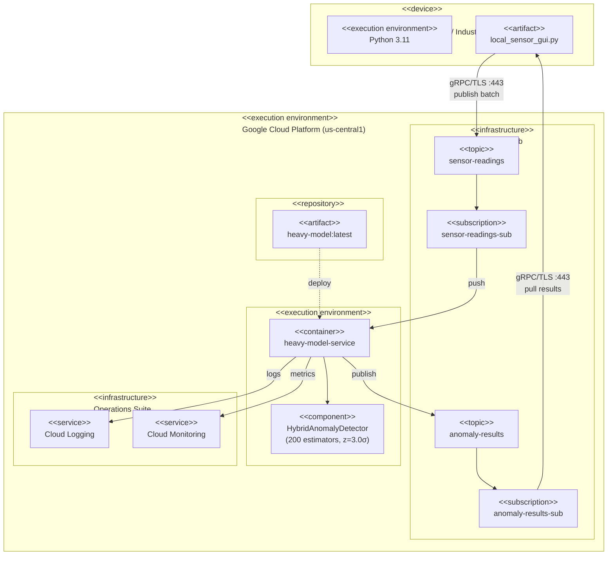
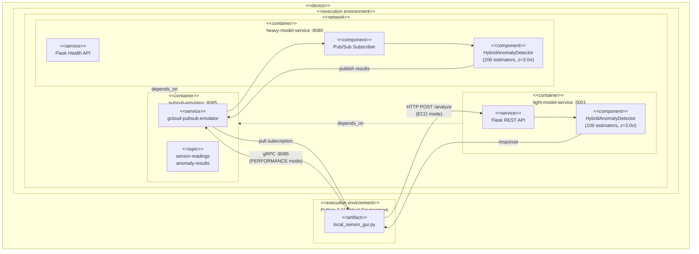

# Deployment Diagram

This document describes the runtime deployment architecture of the Carbon-Aware IoT Anomaly Detection System using UML deployment notation, focusing on execution environments, nodes, and deployed artifacts.

---

## Production Deployment (GCP)

---

## Local Development Deployment

---

## Node Specifications

### Edge Device Node

| Property | Value |
|----------|-------|
| **Node Type** | Physical device (Raspberry Pi) or developer workstation |
| **OS** | Linux (Raspberry Pi OS) / macOS / Windows |
| **Runtime** | Python 3.11 |
| **Deployed Artifact** | \`local_sensor_gui.py\` |
| **Network Requirements** | Internet connectivity to GCP (production) or localhost (development) |

### Cloud Run Execution Environment

| Property | Value |
|----------|-------|
| **Node Type** | Serverless container instance |
| **Scaling** | 0–10 instances (auto-scale based on Pub/Sub backlog) |
| **Memory** | 512 MB per instance |
| **CPU** | 1 vCPU per instance |
| **Deployed Artifact** | \`heavy-model-service:latest\` container image |
| **Image Registry** | Artifact Registry (\`gcr.io/PROJECT/heavy-model\`) |

### Docker Containers (Local Development)

| Container | Base Image | Port Mapping | Health Check |
|-----------|------------|--------------|--------------|
| \`pubsub-emulator\` | \`google/cloud-sdk:slim\` | 8085:8085 (gRPC) | 5s interval, 10 retries |
| \`light-model-service\` | \`python:3.11-slim\` | 5001:5000 (HTTP) | 10s interval, 5 retries |
| \`heavy-model-service\` | \`python:3.11-slim\` | 8080:8080 (HTTP) | 10s interval, 5 retries |

---

## Communication Channels

| Source | Target | Protocol | Port | Purpose |
|--------|--------|----------|------|---------|
| Edge Device | Cloud Pub/Sub | gRPC/TLS | 443 | Publish sensor batches |
| Cloud Pub/Sub | Cloud Run | gRPC (push) | Internal | Subscription delivery |
| Cloud Run | Cloud Pub/Sub | gRPC | Internal | Publish detection results |
| Cloud Pub/Sub | Edge Device | gRPC/TLS | 443 | Pull anomaly results |
| Edge Device | Light Model API | HTTP/REST | 5001 | ECO mode local inference |

---

## Deployment Artifacts

| Artifact | Type | Location | Description |
|----------|------|----------|-------------|
| \`local_sensor_gui.py\` | Python script | \`services/edge/\` | Unified edge application (GUI + sensor + controller) |
| \`light-model-service\` | Docker image | \`deployment/docker/Dockerfile.light\` | Local ML inference service |
| \`heavy-model-service\` | Docker image | \`deployment/docker/Dockerfile.heavy\` | Cloud ML inference service |
| \`hybrid_detector.py\` | Python module | \`models/\` | Shared ML detection logic |
