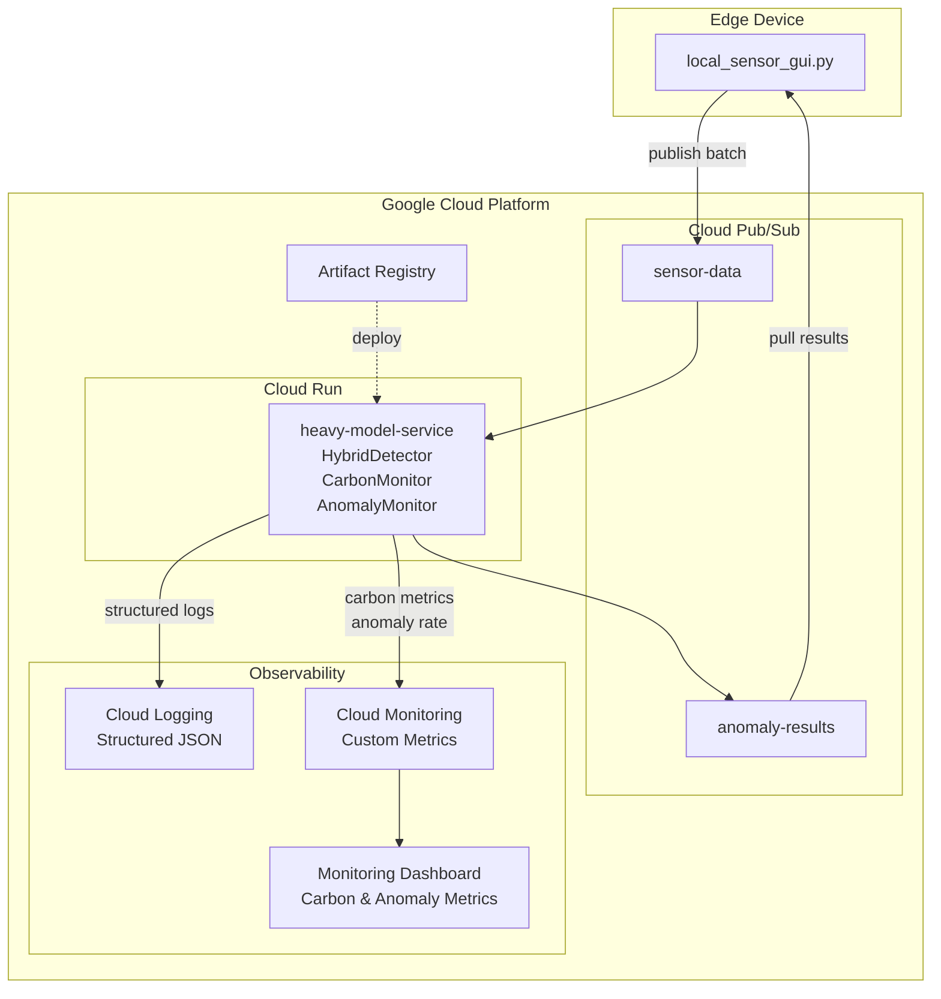
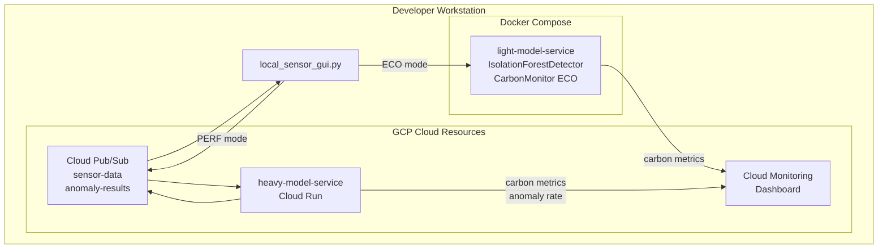

# Deployment Diagram

This document describes the runtime deployment architecture of the Carbon-Aware IoT Anomaly Detection System.

---

## Production Deployment - GCP

**Production Node Specifications:**

| Node | Type | Configuration |
|------|------|---------------|
| Edge Device | Raspberry Pi / Industrial PC | Python 3.11 |
| Cloud Run | Serverless container | 0-10 instances, 512MB, 1 vCPU |
| Cloud Pub/Sub | Managed messaging | 99.9% SLA |
| Artifact Registry | Container registry | Docker images |

---

## Local Development Deployment

**Local Container Configuration:**

| Container | Port | Health Check |
|-----------|------|--------------|
| pubsub-emulator | 8085 | 5s interval, 10 retries |
| light-model-service | 5001 | 10s interval, 5 retries |
| heavy-model-service | 8080 | 10s interval, 5 retries |

Network: `carbon-aware-network`

---

## Node Specifications

### Edge Device Node

| Property | Value |
|----------|-------|
| Node Type | Raspberry Pi or developer workstation |
| OS | Linux / macOS / Windows |
| Runtime | Python 3.11 |
| Deployed Artifact | `local_sensor_gui.py` |
| Network | Internet to GCP or localhost for dev |

### Cloud Run Execution Environment

| Property | Value |
|----------|-------|
| Node Type | Serverless container |
| Scaling | 0-10 instances auto-scale |
| Memory | 512 MB per instance |
| CPU | 1 vCPU per instance |
| Deployed Artifact | `heavy-model-service:latest` |
| Image Registry | `gcr.io/PROJECT/heavy-model` |

### Docker Containers - Local Development

| Container | Base Image | Port Mapping |
|-----------|------------|--------------|
| pubsub-emulator | google/cloud-sdk:slim | 8085:8085 |
| light-model-service | python:3.11-slim | 5001:5000 |
| heavy-model-service | python:3.11-slim | 8080:8080 |

---

## Communication Channels

| Source | Target | Protocol | Port | Purpose |
|--------|--------|----------|------|---------|
| Edge | Cloud Pub/Sub | gRPC/TLS | 443 | Publish sensor batches |
| Cloud Pub/Sub | Cloud Run | gRPC | Internal | Subscription delivery |
| Cloud Run | Cloud Pub/Sub | gRPC | Internal | Publish detection results |
| Cloud Pub/Sub | Edge | gRPC/TLS | 443 | Pull anomaly results |
| Edge | Light Model API | HTTP/REST | 5001 | ECO mode local inference |

---

## Deployment Artifacts

| Artifact | Type | Location | Description |
|----------|------|----------|-------------|
| local_sensor_gui.py | Python script | services/edge/ | Unified edge application |
| light-model-service | Docker image | Dockerfile.light | Local ML inference |
| heavy-model-service | Docker image | Dockerfile.heavy | Cloud ML inference |
| hybrid_detector.py | Python module | models/ | Shared ML detection logic |
