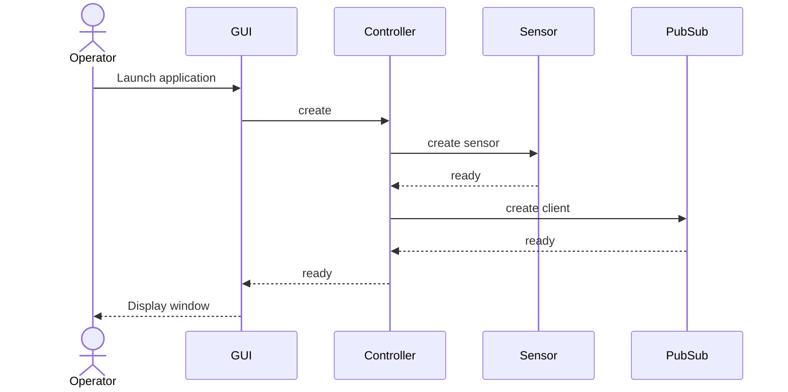
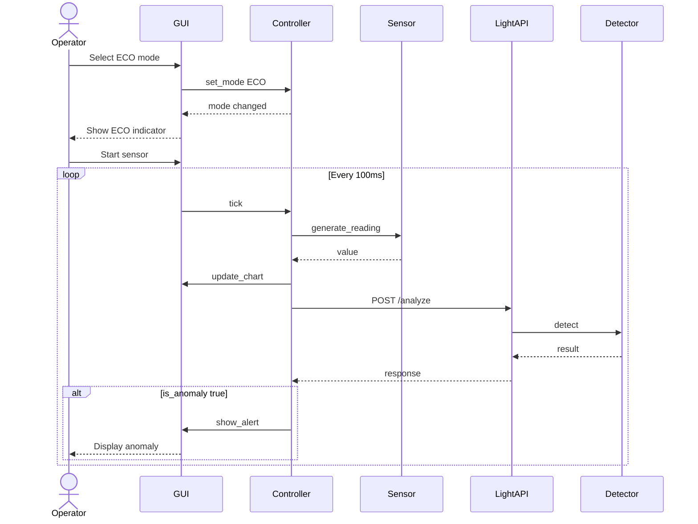
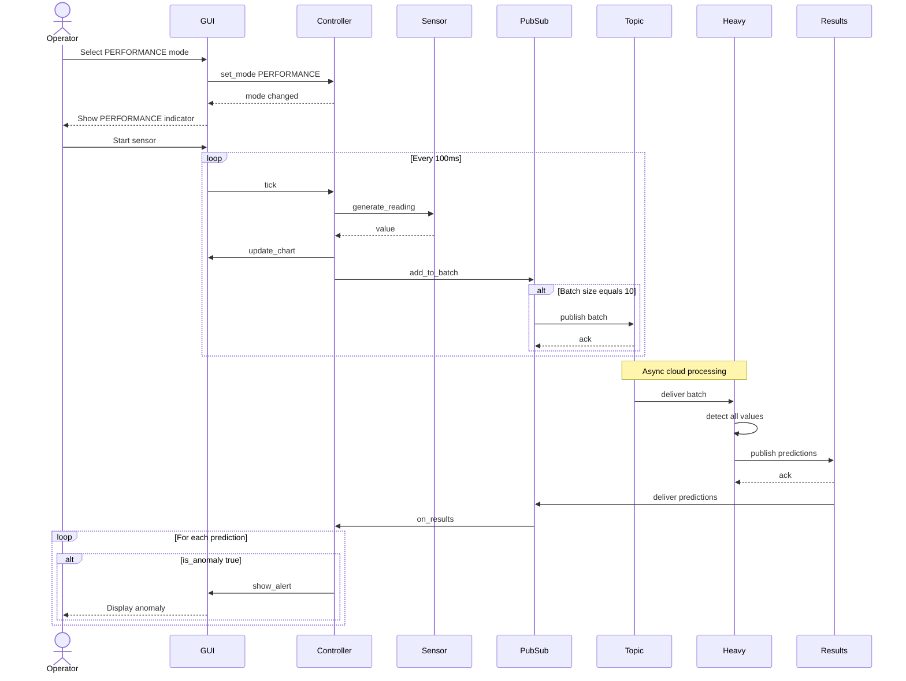
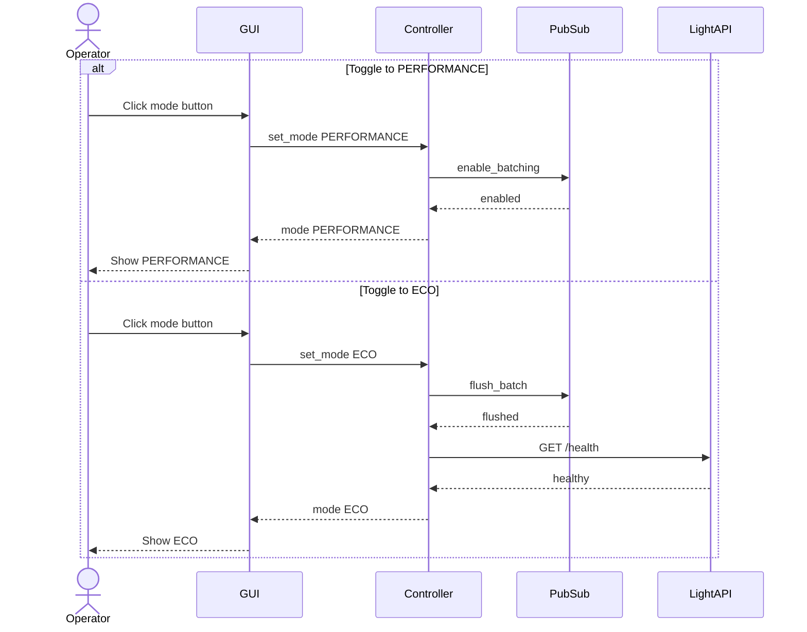
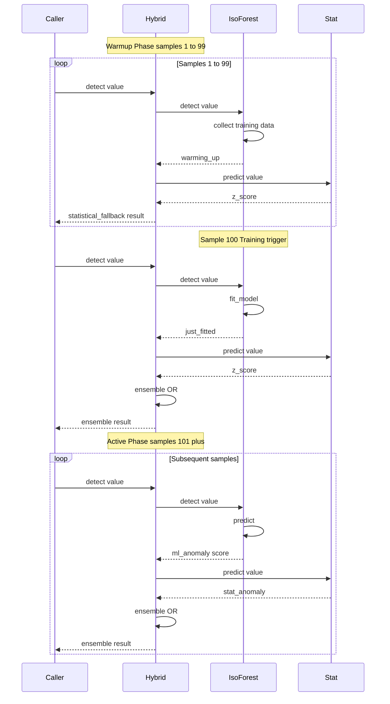

# Sequence Diagrams

This document contains UML sequence diagrams showing the runtime interactions between system components.

---

## System Initialization

---

## ECO Mode - Local Inference

When the operator selects ECO mode, each sensor reading is processed locally via REST API.

---

## PERFORMANCE Mode - Cloud Batch Processing

When the operator selects PERFORMANCE mode, readings are batched and sent to the cloud via Pub/Sub.

---

## Mode Toggle

---

## ML Warmup Sequence

This diagram shows how the HybridAnomalyDetector transitions from statistical-only detection to full ensemble mode.

